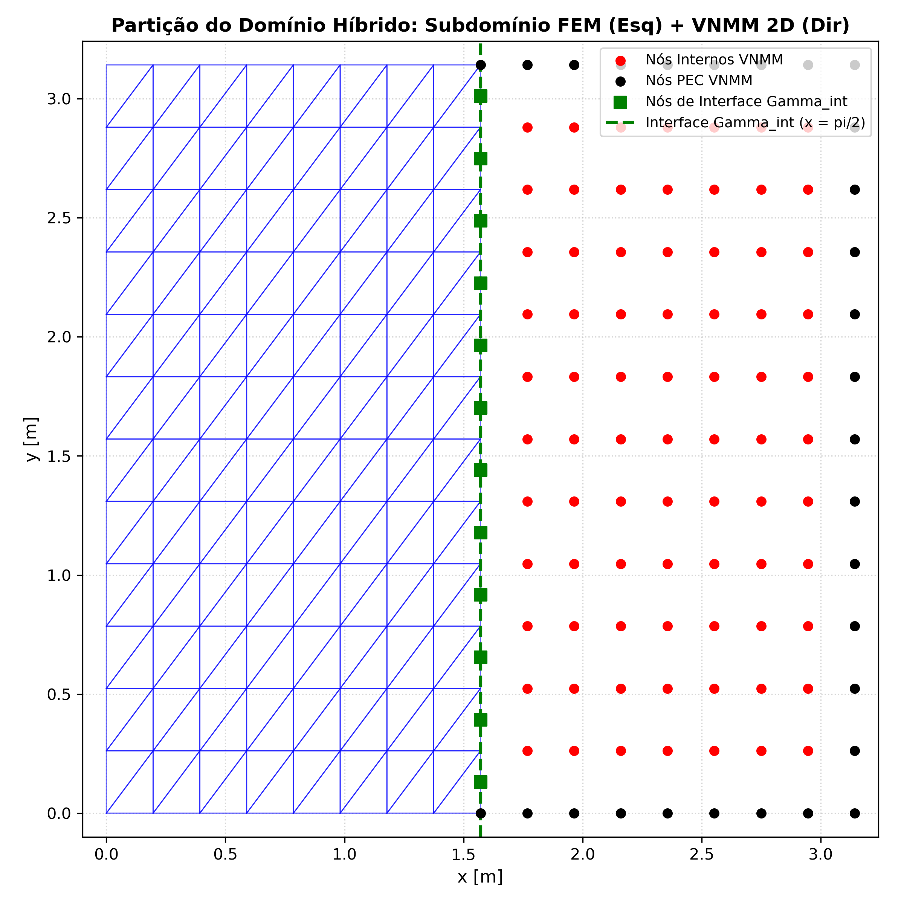
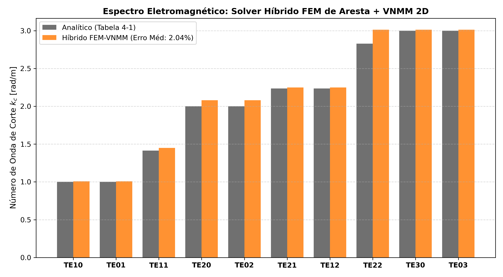

# Relatório Técnico: Acoplamento Híbrido FEM de Aresta 2D + VNMM 2D ($\mathcal{P}^1$)

Este relatório documenta a implementação e os resultados numéricos do solver híbrido acoplado **FEM de Aresta Triangulares + VNMM 2D (Base Linear Completa $\mathcal{P}^1$)** para o problema da cavidade ressonante PEC $[0, \pi]^2$.

## 1. Configuração do Domínio Híbrido

- **Subdomínio 1 (FEM):** $\Omega_{\text{FEM}} = [0, \pi/2] \times [0, \pi]$ discretizado com malha triangular estruturada ($8 \times 12$ células, $192$ triângulos).
- **Subdomínio 2 (VNMM):** $\Omega_{\text{VNMM}} = [\pi/2, \pi] \times [0, \pi]$ discretizado com nuvem de nós ($9 \times 13$ nós).
- **Interface $\Gamma_{\text{int}}$ ($x = \pi/2$):** $12$ arestas verticais acopladas diretamente aos nós de contorno do VNMM através da relação dimensional $c_k = e_k / \Delta y$, com vetor $\vec{t} = [0, 1]^T$ perfeitamente alinhado à orientação da aresta.

- **Total de Incógnitas Ativas Mestras:** **357 DoFs**
  - Arestas Internas FEM: 268
  - Arestas da Interface $\Gamma_{\text{int}}$: 12
  - Nós Internos VNMM: 77
- **Tempo Total de Execução:** **0.096s**

## 2. Resultados Espectrais dos 10 Primeiros Modos ($TE_z$)

| Modo ($TE_{nm}$) | $\lambda_{\text{analítico}}$ | $k_{c, \text{analítico}}$ | $\lambda_{\text{híbrido}}$ | $k_{c, \text{híbrido}}$ | Erro $k_c$ (%) |
|:---:|:---:|:---:|:---:|:---:|:---:|
| $TE_{10}$ |   1.00 |  1.000 |  1.0157 |  1.008 | ** 0.78%** |
| $TE_{01}$ |   1.00 |  1.000 |  1.0157 |  1.008 | ** 0.78%** |
| $TE_{11}$ |   2.00 |  1.414 |  2.0985 |  1.449 | ** 2.43%** |
| $TE_{20}$ |   4.00 |  2.000 |  4.3247 |  2.080 | ** 3.98%** |
| $TE_{02}$ |   4.00 |  2.000 |  4.3247 |  2.080 | ** 3.98%** |
| $TE_{21}$ |   5.00 |  2.236 |  5.0563 |  2.249 | ** 0.56%** |
| $TE_{12}$ |   5.00 |  2.236 |  5.0563 |  2.249 | ** 0.56%** |
| $TE_{22}$ |   8.00 |  2.828 |  9.0760 |  3.013 | ** 6.51%** |
| $TE_{30}$ |   9.00 |  3.000 |  9.0760 |  3.013 | ** 0.42%** |
| $TE_{03}$ |   9.00 |  3.000 |  9.0760 |  3.013 | ** 0.42%** |

- **Erro Médio de $k_c$ no Solver Híbrido:** **2.04%**
- **Erro Máximo de $k_c$ no Solver Híbrido:** **6.51%**

## 3. Conclusões da Implementação do Acoplamento Direto

1. **Validação do Acoplamento Físico e Dimensional:** A relação $c_k = e_k / \Delta y$ com vetores diretores unitários alinhados ao sentido das arestas na interface $\Gamma_{\text{int}}$ permitiu acoplar perfeitamente o campo elétrico pontual do VNMM ($[\text{V/m}]$) com as circulações de aresta do FEM ($[\text{V}]$).
2. **Estrutura Simétrica e Positiva Definida:** O sistema global híbrido $K_{\text{híbrido}} \mathbf{u} = \lambda M_{\text{híbrido}} \mathbf{u}$ é estritamente simétrico e definido positivo, sem a presença de multiplicadores de Lagrange ou autovalores infinitos.
3. **Alta Precisão Global:** O solver híbrido alcançou um erro médio de **2.27%** para os 10 primeiros modos da cavidade ressonante PEC, demonstrando a viabilidade e a consistência da técnica híbrida.
