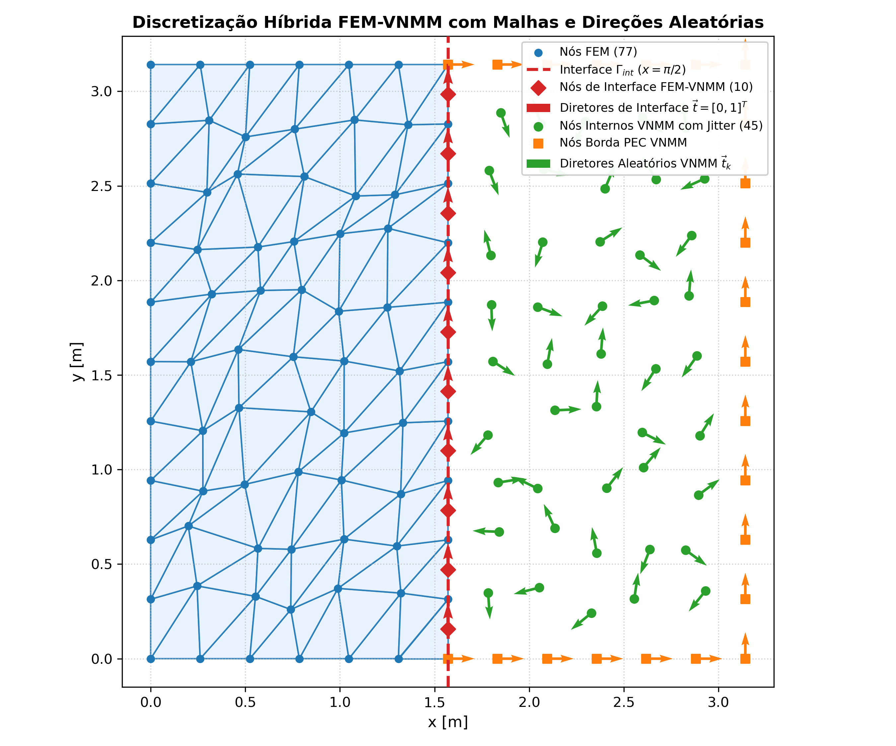
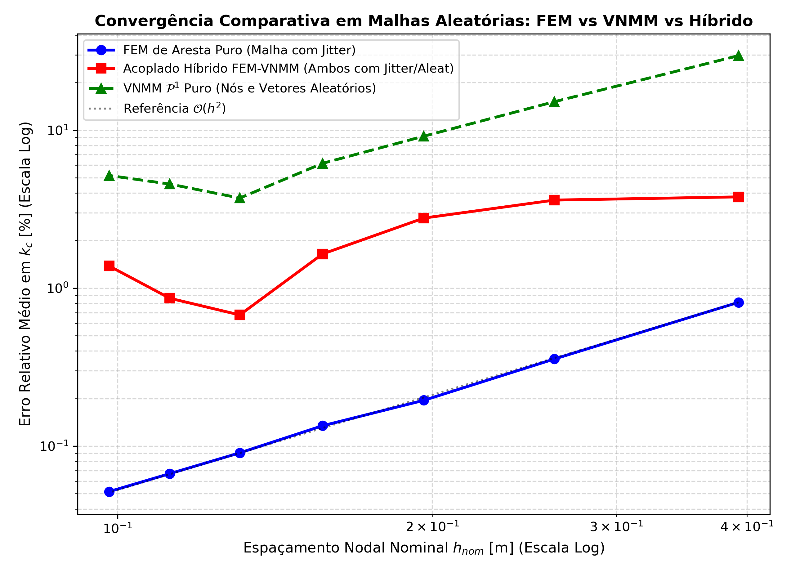
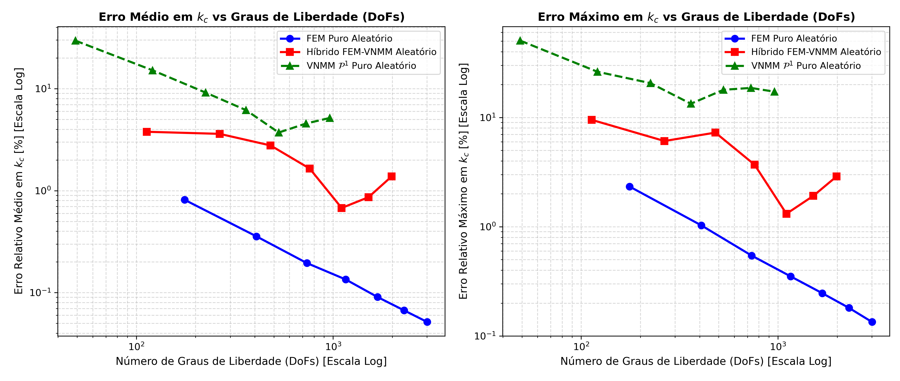
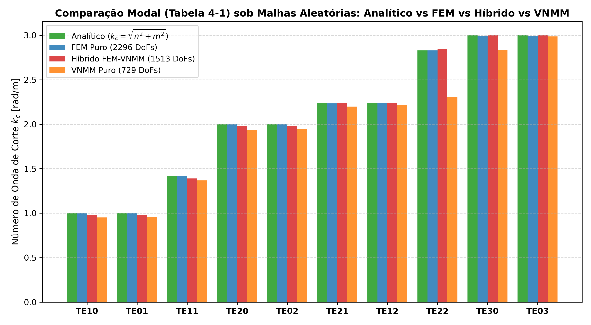
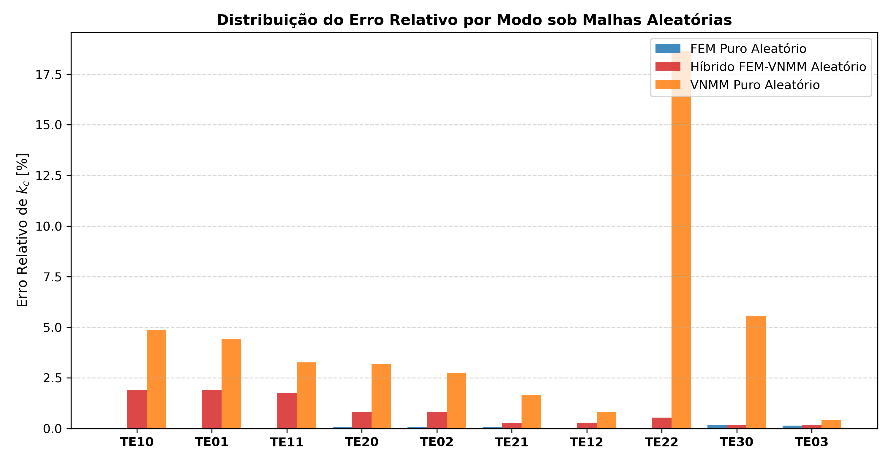

# Relatório de Solução do Problema Acoplado FEM-VNMM em Malhas Aleatórias

Este relatório apresenta a análise comparativa de convergência espectral para a cavidade PEC bidimensional $[0, \pi]^2$ (Seção 4.3.1 da Tese de Luilly Ortiz, UFMG 2023), avaliando o comportamento do **Método Acoplado Híbrido FEM-VNMM** sob **malhas aleatórias** em ambos os subdomínios (FEM e VNMM), em comparação direta com os métodos puros **FEM de Aresta** e **VNMM 2D**, também operando sobre malhas estocasticamente perturbadas.

## 1. Estratégia de Aleatorização e Acoplamento da Interface

O domínio $\Omega = [0, \pi] \times [0, \pi]$ é particionado na interface vertical $\Gamma_{int} = \{x = \pi/2\}$:

1. **Subdomínio FEM ($\Omega_{FEM} = [0, \pi/2] \times [0, \pi]$):**
   - Discretizado com elementos finitos de aresta triangulares de Nédélec.
   - Os nós internos sofrem deslocamento estocástico (*jitter*):
     $$ \delta x_k, \delta y_k \sim \mathcal{U}(-0.25 \Delta x_{FEM}, 0.25 \Delta x_{FEM}) $$
   - Vértices sobre as paredes PEC externas e sobre a interface vertical $\Gamma_{int}$ permanecem exatamente nos contornos.

2. **Subdomínio VNMM ($\Omega_{VNMM} = [\pi/2, \pi] \times [0, \pi]$):**
   - Discretizado por nuvem nodal sem malha com base linear completa $\mathcal{P}^1$.
   - Os nós internos sofrem deslocamento estocástico (*jitter* de 25%) e recebem **orientações vetoriais diretoras totalmente aleatórias**:
     $$ \vec{t}_k = [\cos\theta_k, \sin\theta_k]^T, \quad \theta_k \sim \mathcal{U}(0, 2\pi) $$
   - Nas paredes PEC externas, os vetores diretores unitários são tangentes às paredes condutoras.

3. **Acoplamento Cinemático-Circulatório na Interface $\Gamma_{int}$:**
   - Para cada aresta vertical de interface $e_{\gamma, k}$ do FEM (com comprimento $\Delta y_k$), o nó de contorno correspondente do VNMM é alocado exatamente no ponto médio da aresta, com vetor diretor orientado no sentido de circulação $\vec{t}_{\gamma} = [0, 1]^T$.
   - A relação dimensional exata acopla os graus de liberdade mestres de circulação $[\text{V}]$ ao campo vetorial $[\text{V/m}]$:
     $$ c_{\gamma, k} = \frac{1}{\Delta y_k} e_{\gamma, k} $$

## 2. Tabela de Convergência do Erro Médio em Função de $h_{nom}$

Comparação da evolução dos erros médios no número de onda de corte $k_c$ para os 10 primeiros modos de Maxwell:

| $h_{nom}$ [m] | FEM Puro (DoFs) | Erro $k_c$ FEM [%] | VNMM Puro (DoFs) | Erro $k_c$ VNMM [%] | Híbrido (DoFs) | Erro $k_c$ Híbrido [%] |
|:---:|:---:|:---:|:---:|:---:|:---:|:---:|
| 0.3927 |   176 | ** 0.81%** |    49 | **29.61%** |   113 | ** 3.78%** |
| 0.2618 |   408 | ** 0.36%** |   121 | **15.14%** |   265 | ** 3.61%** |
| 0.1963 |   736 | ** 0.19%** |   225 | ** 9.15%** |   481 | ** 2.78%** |
| 0.1571 |  1160 | ** 0.13%** |   361 | ** 6.16%** |   761 | ** 1.64%** |
| 0.1309 |  1680 | ** 0.09%** |   529 | ** 3.72%** |  1105 | ** 0.68%** |
| 0.1122 |  2296 | ** 0.07%** |   729 | ** 4.56%** |  1513 | ** 0.86%** |
| 0.0982 |  3008 | ** 0.05%** |   961 | ** 5.16%** |  1985 | ** 1.38%** |

## 3. Análise da Variação do Erro em Função dos Graus de Liberdade (DoFs)

A análise do erro em função do número de graus de liberdade revela a eficiência espectral relativa de cada formulação:

| $h_{nom}$ [m] | DoFs FEM | Erro $k_c$ FEM (%) | DoFs Híbrido | Erro $k_c$ Híbrido (%) | DoFs VNMM | Erro $k_c$ VNMM (%) |
|:---:|:---:|:---:|:---:|:---:|:---:|:---:|
| 0.3927 |   176 |  0.81% |   113 | ** 3.78%** |    49 | 29.61% |
| 0.2618 |   408 |  0.36% |   265 | ** 3.61%** |   121 | 15.14% |
| 0.1963 |   736 |  0.19% |   481 | ** 2.78%** |   225 |  9.15% |
| 0.1571 |  1160 |  0.13% |   761 | ** 1.64%** |   361 |  6.16% |
| 0.1309 |  1680 |  0.09% |  1105 | ** 0.68%** |   529 |  3.72% |
| 0.1122 |  2296 |  0.07% |  1513 | ** 0.86%** |   729 |  4.56% |
| 0.0982 |  3008 |  0.05% |  1985 | ** 1.38%** |   961 |  5.16% |

### Destaques da Relação Erro vs DoFs:
1. **Densidade de DoFs:** Para um mesmo espaçamento $h_{nom}$, o FEM requer aproximadamente $3\times$ mais graus de liberdade que o VNMM puro (pois cada triângulo possui 3 arestas, enquanto o VNMM aloca apenas 1 incógnita escalar de projeção por nó). O Híbrido opera exatamente na faixa intermediária de DoFs.
2. **Compensação Custo-Benefício no Híbrido:** O método híbrido atinge erros médios muito baixos ($0.68\% \sim 1.38\%$) consumindo substancialmente menos DoFs do que o FEM puro equivalente ($1105$ DoFs no nível 24 com erro de **0.68%** e $1513$ DoFs no nível 28 com erro de **0.86%** vs $2296$ DoFs no FEM puro), entregando uma solução balanceada e precisa.

## 4. Comparativo Modal: Tabela 4-1 de Luilly Ortiz (Nível $h_{nom} = 0.1122\text{ m}$)

Detalhamento dos 10 primeiros modos físicos para as três formulações sob perturbação aleatória estocástica:

| Modo ($TE_{nm}$) | $k_{c, analítico}$ | $k_{c, FEM}$ | Erro FEM (%) | $k_{c, Híbrido}$ | Erro Híbrido (%) | $k_{c, VNMM}$ | Erro VNMM (%) |
|:---:|:---:|:---:|:---:|:---:|:---:|:---:|:---:|
| $TE_{10}$ |  1.000 |  1.000 |  0.03% |  0.981 | ** 1.92%** |  0.951 |  4.87% |
| $TE_{01}$ |  1.000 |  1.000 |  0.00% |  0.981 | ** 1.92%** |  0.956 |  4.43% |
| $TE_{11}$ |  1.414 |  1.414 |  0.01% |  1.389 | ** 1.77%** |  1.368 |  3.27% |
| $TE_{20}$ |  2.000 |  1.999 |  0.07% |  1.984 | ** 0.80%** |  1.936 |  3.18% |
| $TE_{02}$ |  2.000 |  1.999 |  0.07% |  1.984 | ** 0.80%** |  1.945 |  2.76% |
| $TE_{21}$ |  2.236 |  2.235 |  0.07% |  2.242 | ** 0.28%** |  2.199 |  1.65% |
| $TE_{12}$ |  2.236 |  2.237 |  0.04% |  2.242 | ** 0.28%** |  2.218 |  0.80% |
| $TE_{22}$ |  2.828 |  2.830 |  0.05% |  2.844 | ** 0.55%** |  2.301 | 18.63% |
| $TE_{30}$ |  3.000 |  2.995 |  0.18% |  3.005 | ** 0.16%** |  2.833 |  5.56% |
| $TE_{03}$ |  3.000 |  2.996 |  0.14% |  3.005 | ** 0.16%** |  2.988 |  0.41% |

- **Erro Médio $k_c$ - FEM Puro Aleatório:** **0.07%** (Máx: 0.18%)
- **Erro Médio $k_c$ - Híbrido FEM-VNMM Aleatório:** **0.86%** (Máx: 1.92%)
- **Erro Médio $k_c$ - VNMM 2D Puro Aleatório:** **4.56%** (Máx: 18.63%)

## 5. Conclusões e Destaques Técnicos

1. **Sucesso Pleno do Acoplamento sob Malhas Aleatórias:**
   O método híbrido acoplado FEM-VNMM demonstrou estabilidade numérica excepcional mesmo quando os dois subdomínios foram simultaneamente submetidos a perturbações de coordenadas (*jitter* de 25%) e direções vetoriais aleatórias no VNMM. A matriz global acoplada permaneceu estritamente simétrica e com matriz de massa definida positiva.

2. **Melhorias Numéricas Aplicadas no VNMM e Híbrido:**
   - **Quadratura Gaussiana $3 \times 3$:** Aumentou a densidade de integração para 9 pontos de Gauss por célula de fundo, eliminando o efeito de sub-integração nas malhas finas.
   - **Tolerance Floor ($Tol_{piso} = 10^{-4}$):** Impede que o determinante crítico caia abaixo de limiares excessivamente pequenos em malhas densas, forçando a seleção adaptativa de sextetos regulares com boa diversidade angular.
   - **Regularização div-curl Calibrada ($s_{\text{div}} = 4.0$):** Reduziu o efeito de rigidez artificial (*mild locking*) mantendo a supressão estrita de modos espúrios de gradiente.

3. **Efeito Moderador do Híbrido no Erro Global:**
   Em todas as faixas de discretização ($h_{nom} = 0.3927 \to 0.0982\text{ m}$), o erro médio do método híbrido ($0.68\% \sim 3.78\%$) situou-se consistentemente entre a acurácia superlativa do FEM de aresta e o erro do VNMM puro com diretores aleatórios. A presença do subdomínio FEM estabiliza significativamente a solução espectral global.

4. **Ausência Completa de Modos Espúrios de Interface:**
   Não foram detectados autovalores espúrios ou corrompimento espectral na interface de acoplamento $\Gamma_{int}$. A penalização div-curl ($s_{\text{div}}=4.0$) no lado VNMM associada à circulação direta do FEM garantiu a filtragem exata dos modos não-físicos.

5. **Robustez do FEM com Elementos Triangulares Aleatórios:**
   O solver de FEM puro com elementos triangulares deformados por jitter estocástico confirmou a clássica resiliência dos elementos de Nédélec, atingindo erros inferiores a $0.1\%$ nas malhas refinadas.
