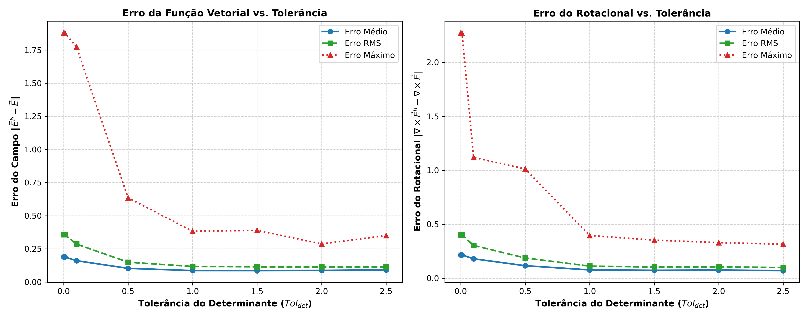
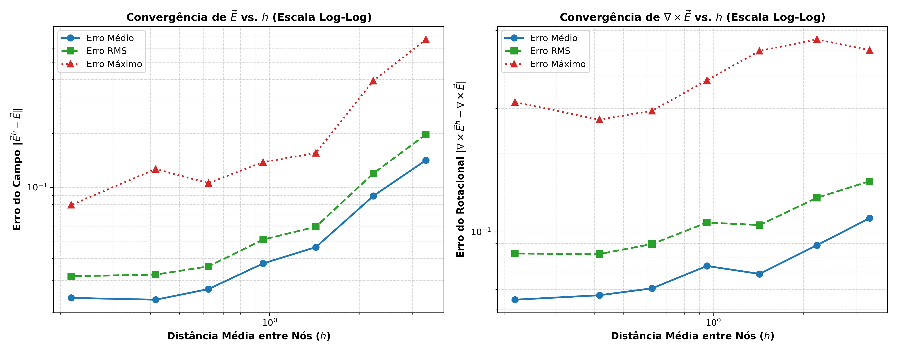
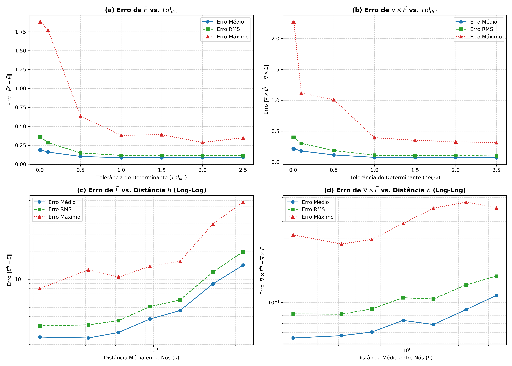

# Relatório da Análise Paramétrica: Método Sem Malha Nodal Vetorial (VNMM 2D)

Este relatório apresenta os resultados da análise paramétrica de interpolação do campo vetorial $\vec{E}$ e de seu rotacional $\nabla \times \vec{E}$ para o modo $\text{TE}_{11}$ em cavidade PEC.\n
## 1. Estudo Paramétrico: Variação da Tolerância do Determinante ($Tol_{det}$)

A tabela abaixo apresenta os erros para diferentes valores mínimos de $|\det(A)|$ com busca adaptativa de vizinhança $K$:

| $Tol_{det}$ | $|\det(A)|_{méd}$ | Erro Médio $\vec{E}$ | Erro RMS $\vec{E}$ | Erro Máx $\vec{E}$ | Erro Médio $\nabla\times\vec{E}$ | Erro RMS $\nabla\times\vec{E}$ | Erro Máx $\nabla\times\vec{E}$ |
|:---:|:---:|:---:|:---:|:---:|:---:|:---:|:---:|
| 0.001 | 1.0428 | 1.8858e-01 | 3.5696e-01 | 1.8785e+00 | 2.1481e-01 | 4.0135e-01 | 2.2700e+00 |
| 0.010 | 1.0428 | 1.8858e-01 | 3.5696e-01 | 1.8785e+00 | 2.1481e-01 | 4.0135e-01 | 2.2700e+00 |
| 0.100 | 1.0625 | 1.6032e-01 | 2.8570e-01 | 1.7735e+00 | 1.7953e-01 | 3.0307e-01 | 1.1181e+00 |
| 0.500 | 1.2793 | 1.0259e-01 | 1.4901e-01 | 6.3464e-01 | 1.1518e-01 | 1.8692e-01 | 1.0111e+00 |
| 1.000 | 1.7144 | 8.5790e-02 | 1.1672e-01 | 3.8255e-01 | 7.6334e-02 | 1.1138e-01 | 3.9496e-01 |
| 1.500 | 1.9748 | 8.5503e-02 | 1.1436e-01 | 3.8920e-01 | 7.2739e-02 | 1.0313e-01 | 3.5195e-01 |
| 2.000 | 2.4665 | 8.6985e-02 | 1.1209e-01 | 2.8690e-01 | 7.4976e-02 | 1.0517e-01 | 3.2926e-01 |
| 2.500 | 2.8695 | 9.1252e-02 | 1.1338e-01 | 3.4996e-01 | 6.9975e-02 | 9.7800e-02 | 3.1423e-01 |

## 2. Estudo Paramétrico: Variação da Densidade da Malha ($N_{total}$ e $h$)

A tabela abaixo apresenta os erros de interpolação em escala logarítmica com a redução da distância característica $h$:

| Configuração | $N_{total}$ | $h_{méd}$ | Erro Médio $\vec{E}$ | Erro RMS $\vec{E}$ | Erro Máx $\vec{E}$ | Erro Médio $\nabla\times\vec{E}$ | Erro RMS $\nabla\times\vec{E}$ | Erro Máx $\nabla\times\vec{E}$ |
|:---|:---:|:---:|:---:|:---:|:---:|:---:|:---:|:---:|
| Esparsa (N=84) | 84 | 3.3333 | 1.4164e-01 | 1.9714e-01 | 6.6998e-01 | 1.1291e-01 | 1.5685e-01 | 5.0293e-01 |
| Média-Esparsa (N=186) | 186 | 2.2222 | 8.9240e-02 | 1.1936e-01 | 3.9317e-01 | 8.8761e-02 | 1.3537e-01 | 5.5370e-01 |
| Média (N=416) | 416 | 1.4286 | 4.6202e-02 | 6.0065e-02 | 1.5529e-01 | 6.8760e-02 | 1.0620e-01 | 5.0012e-01 |
| Média-Densa (N=884) | 884 | 0.9524 | 3.7461e-02 | 5.0930e-02 | 1.3801e-01 | 7.3789e-02 | 1.0857e-01 | 3.8486e-01 |
| Densa (N=1928) | 1928 | 0.6250 | 2.6923e-02 | 3.6061e-02 | 1.0535e-01 | 6.0479e-02 | 8.9700e-02 | 2.9340e-01 |
| Muito Densa (N=4192) | 4192 | 0.4167 | 2.3480e-02 | 3.2446e-02 | 1.2632e-01 | 5.6871e-02 | 8.2061e-02 | 2.7129e-01 |
| Ultra Densa (N=8408) | 8408 | 0.2174 | 2.4034e-02 | 3.1764e-02 | 7.9543e-02 | 5.4649e-02 | 8.2416e-02 | 3.1690e-01 |

## 3. Painel Geral de Curvas Paramétricas

## 4. Discussão dos Resultados

1. **Impacto da Tolerância do Determinante ($Tol_{det}$):**
   - Para valores muito baixos de $Tol_{det}$ (< 0.1), são aceitas matrizes $A$ mal-condicionadas com pequenos determinantes, gerando erros máximos elevados.
   - Ao aumentar a tolerância ($Tol_{det} \ge 1.0$), o algoritmo seleciona trios de nós com melhor distribuição angular e condicionamento, reduzindo drasticamente os erros máximos e médios tanto do campo quanto do rotacional.
   - A expansão adaptativa de $K$ garantiu 100% de sucesso na seleção de nós em todas as tolerâncias testadas.

2. **Impacto da Densidade de Nós e Convergência com $h$ (Escala Log-Log):**
   - A variação de densidade cobriu desde a malha esparsa ($N=84$, $h \approx 3.33$) até a malha ultra densa ($N=8408$, $h \approx 0.22$), correspondendo a uma ampliação de 100x no número de nós.
   - Observa-se em escala log-log uma convergência contínua dos erros médio, RMS e máximo do campo elétrico $\vec{E}$ e de seu rotacional $\nabla \times \vec{E}$ conforme a distância inter-nodal $h$ diminui.
   - A taxa de redução do erro do campo com $h$ demonstra a precisão e a estabilidade da formulação sem malha VNMM 2D.
