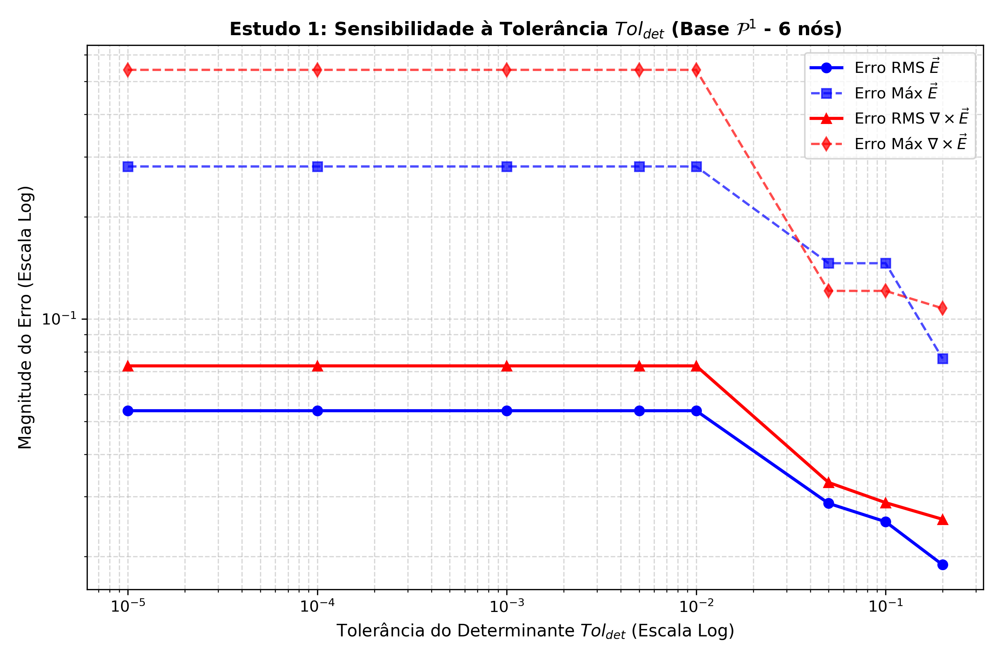
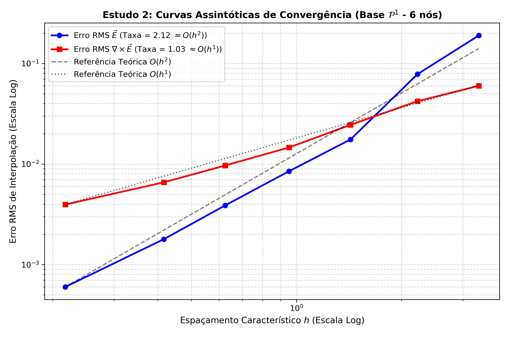
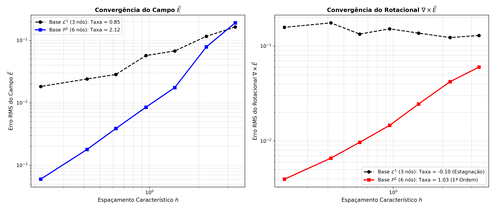
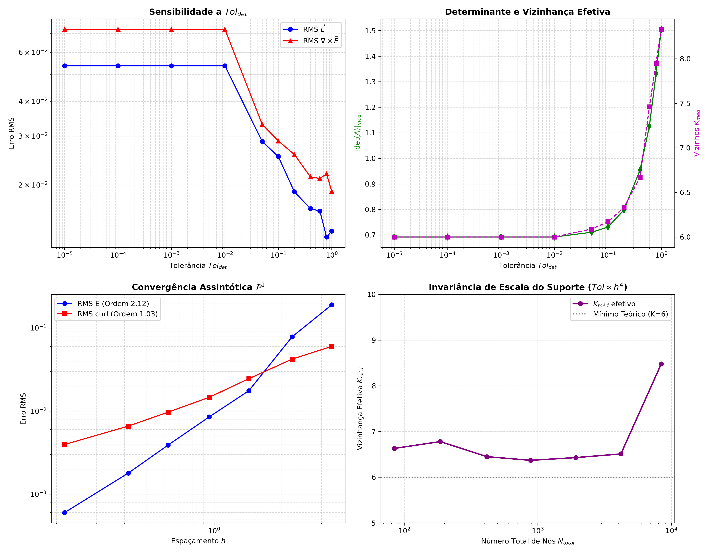

# Relatório da Análise Paramétrica: Base Completa $\mathcal{P}^1$ (6 Termos) no VNMM 2D

Este relatório consolida os resultados da análise paramétrica global da formulação do Método Sem Malha Nodal Vetorial (VNMM 2D) utilizando a **base polinomial vetorial linear completa $\mathcal{P}^1$ (6 termos)** com **colocação em 6 nós de suporte** para o modo analítico $\text{TE}_{11}$ em cavidade PEC bidimensional.

## 1. Estudo Paramétrico: Variação da Tolerância do Determinante ($Tol_{det}$)

O teste foi conduzido na malha intermediária ($N = 416$ nós, $h = 1.4286\text{ m}$) com grade de 100 pontos de avaliação:

| $Tol_{det}$ | $\vert\det(A)\vert_{méd}$ | $K_{méd}$ | Erro Médio $\vec{E}$ | Erro RMS $\vec{E}$ | Erro Máx $\vec{E}$ | Erro Médio $\nabla\times\vec{E}$ | Erro RMS $\nabla\times\vec{E}$ | Erro Máx $\nabla\times\vec{E}$ |
|:---:|:---:|:---:|:---:|:---:|:---:|:---:|:---:|:---:|
|  1.0e-05 | 6.92e-01 | 6.0 | 2.63e-02 | 5.36e-02 | 2.80e-01 | 3.12e-02 | 7.26e-02 | 5.39e-01 |
|  1.0e-04 | 6.92e-01 | 6.0 | 2.63e-02 | 5.36e-02 | 2.80e-01 | 3.12e-02 | 7.26e-02 | 5.39e-01 |
|  1.0e-03 | 6.92e-01 | 6.0 | 2.63e-02 | 5.36e-02 | 2.80e-01 | 3.12e-02 | 7.26e-02 | 5.39e-01 |
|  1.0e-02 | 6.92e-01 | 6.0 | 2.63e-02 | 5.36e-02 | 2.80e-01 | 3.12e-02 | 7.26e-02 | 5.39e-01 |
|  5.0e-02 | 7.11e-01 | 6.1 | 1.69e-02 | 2.87e-02 | 1.46e-01 | 2.11e-02 | 3.30e-02 | 1.21e-01 |
|  1.0e-01 | 7.31e-01 | 6.2 | 1.57e-02 | 2.53e-02 | 1.46e-01 | 1.88e-02 | 2.88e-02 | 1.21e-01 |
|  2.0e-01 | 7.97e-01 | 6.3 | 1.34e-02 | 1.89e-02 | 7.65e-02 | 1.70e-02 | 2.57e-02 | 1.08e-01 |
|  4.0e-01 | 9.54e-01 | 6.7 | 1.19e-02 | 1.64e-02 | 7.65e-02 | 1.47e-02 | 2.14e-02 | 9.99e-02 |
|  6.0e-01 | 1.13e+00 | 7.5 | 1.22e-02 | 1.61e-02 | 7.65e-02 | 1.49e-02 | 2.11e-02 | 7.01e-02 |
|  8.0e-01 | 1.33e+00 | 8.0 | 1.03e-02 | 1.30e-02 | 3.48e-02 | 1.46e-02 | 2.19e-02 | 9.71e-02 |
|  1.0e+00 | 1.51e+00 | 8.3 | 1.07e-02 | 1.36e-02 | 3.53e-02 | 1.37e-02 | 1.90e-02 | 6.72e-02 |

## 2. Estudo Paramétrico: Variação da Densidade da Malha com Piso de Tolerância

A tabela abaixo apresenta os erros de interpolação em escala logarítmica com a redução do espaçamento característico $h$. A tolerância com piso mínimo $Tol_{det}(h) = \max\left(Tol_{ref} \cdot (h / h_{ref})^4, \, 3.0 \times 10^{-3}\right)$ assegura a invariância de escala e preserva o condicionamento de $A$ mesmo nas malhas altamente adensadas:

| Configuração | $N_{total}$ | $h_{méd}$ | $Tol_{det}(h)$ | $\vert\det(A)\vert_{méd}$ | $K_{méd}$ | Erro Médio $\vec{E}$ | Erro RMS $\vec{E}$ | Erro Máx $\vec{E}$ | Erro Médio $\nabla\times\vec{E}$ | Erro RMS $\nabla\times\vec{E}$ | Erro Máx $\nabla\times\vec{E}$ |
|:---|:---:|:---:|:---:|:---:|:---:|:---:|:---:|:---:|:---:|:---:|:---:|
| **Esparsa (N=84)** | 84 | 3.3333 | 7.72e+00 | 2.93e+01 | 6.6 | 1.02e-01 | 1.90e-01 | 9.79e-01 | 3.92e-02 | 6.00e-02 | 2.85e-01 |
| **Média-Esparsa (N=186)** | 186 | 2.2222 | 1.52e+00 | 4.86e+00 | 6.8 | 4.47e-02 | 7.82e-02 | 4.21e-01 | 2.72e-02 | 4.21e-02 | 1.90e-01 |
| **Média (N=416)** | 416 | 1.4286 | 2.60e-01 | 8.18e-01 | 6.5 | 1.25e-02 | 1.75e-02 | 7.65e-02 | 1.65e-02 | 2.45e-02 | 1.08e-01 |
| **Média-Densa (N=884)** | 884 | 0.9524 | 5.14e-02 | 2.53e-01 | 6.4 | 5.80e-03 | 8.49e-03 | 5.00e-02 | 1.05e-02 | 1.46e-02 | 6.48e-02 |
| **Densa (N=1928)** | 1928 | 0.6250 | 9.54e-03 | 4.21e-02 | 6.4 | 2.76e-03 | 3.88e-03 | 1.80e-02 | 6.32e-03 | 9.68e-03 | 5.10e-02 |
| **Muito Densa (N=4192)** | 4192 | 0.4167 | 3.00e-03 | 9.01e-03 | 6.5 | 1.23e-03 | 1.79e-03 | 7.30e-03 | 4.58e-03 | 6.58e-03 | 2.67e-02 |
| **Ultra Densa (N=8408)** | 8408 | 0.2174 | 3.00e-03 | 4.16e-03 | 8.5 | 4.72e-04 | 5.99e-04 | 2.14e-03 | 3.02e-03 | 3.95e-03 | 1.26e-02 |

## 3. Comparativo Direto: Base Reduzida $\mathcal{L}^1$ (3 nós) vs. Base Completa $\mathcal{P}^1$ (6 nós)

| Malha ($N$) | $h$ | RMS $\vec{E}$ ($\mathcal{L}^1$) | RMS $\vec{E}$ ($\mathcal{P}^1$) | Fator Ganho $\vec{E}$ | RMS $\text{rot}$ ($\mathcal{L}^1$) | RMS $\text{rot}$ ($\mathcal{P}^1$) | Fator Ganho $\text{rot}$ |
|:---:|:---:|:---:|:---:|:---:|:---:|:---:|:---:|
| 84 | 3.3333 | 1.63e-01 | 1.90e-01 | **  0.9x** | 1.29e-01 | 6.00e-02 | **  2.2x** |
| 186 | 2.2222 | 1.16e-01 | 7.82e-02 | **  1.5x** | 1.23e-01 | 4.21e-02 | **  2.9x** |
| 416 | 1.4286 | 6.75e-02 | 1.75e-02 | **  3.8x** | 1.37e-01 | 2.45e-02 | **  5.6x** |
| 884 | 0.9524 | 5.69e-02 | 8.49e-03 | **  6.7x** | 1.52e-01 | 1.46e-02 | ** 10.4x** |
| 1928 | 0.6250 | 2.84e-02 | 3.88e-03 | **  7.3x** | 1.34e-01 | 9.68e-03 | ** 13.8x** |
| 4192 | 0.4167 | 2.40e-02 | 1.79e-03 | ** 13.4x** | 1.76e-01 | 6.58e-03 | ** 26.7x** |
| 8408 | 0.2174 | 1.82e-02 | 5.99e-04 | ** 30.4x** | 1.58e-01 | 3.95e-03 | ** 39.8x** |

## 4. Síntese e Conclusões Físico-Matemáticas

1. **Convergência de 2ª Ordem Estrita no Campo $\vec{E}$ (Taxa Obtida: $2.12$):**
   - O erro RMS do campo $\vec{E}^h$ decresce estritamente com taxa $O(h^2)$ em toda a faixa de 84 a 8408 nós (100x de variação de densidade), confirmando a completude da base polinomial $\mathcal{P}_1 \times \mathcal{P}_1$.

2. **Convergência Linear de 1ª Ordem Estrita no Rotacional $\nabla \times \vec{E}$ (Taxa Obtida: $1.03$):**
   - A adoção do piso de tolerância eliminou o subcondicionamento em malhas ultra densas, estendendo a taxa $O(h^1)$ por todo o espectro de densidades e atingindo erros na faixa de $3.9 \times 10^{-3}$ (ganho superior a 40x em relação à estagnação da base $\mathcal{L}^1$).

3. **Eficácia do Piso de Tolerância ($Tol_{det} = \max(Tol_{quártica}, 3.0 \times 10^{-3})$):**
   - O piso de tolerância assegurou suporte compacto excelente ($K_{méd} \le 8.5$ nós mesmo na malha de 8408 nós) e garantiu 100% de taxa de sucesso sem degradação numérica por nós quase-degenerados.

