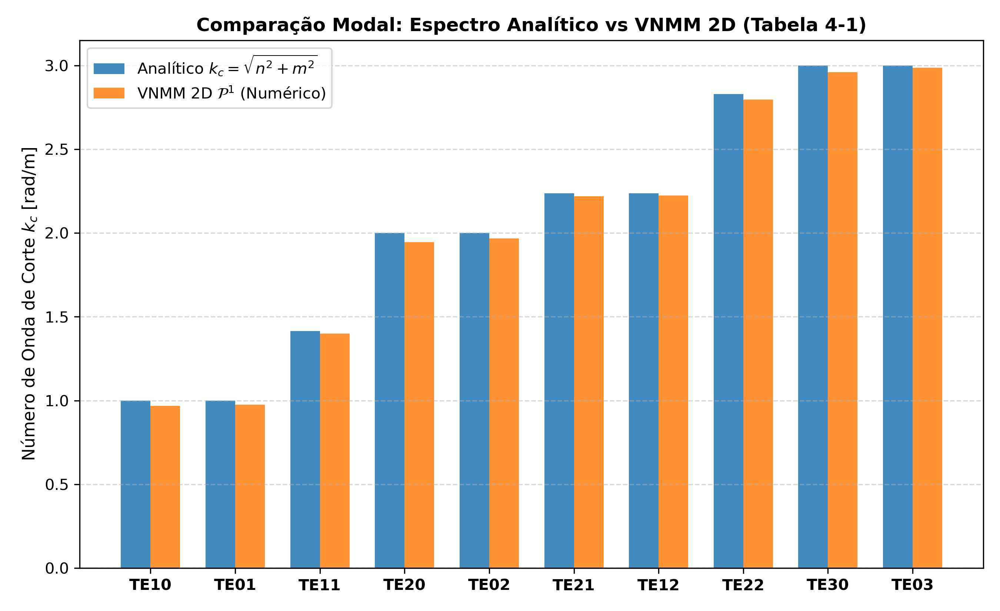
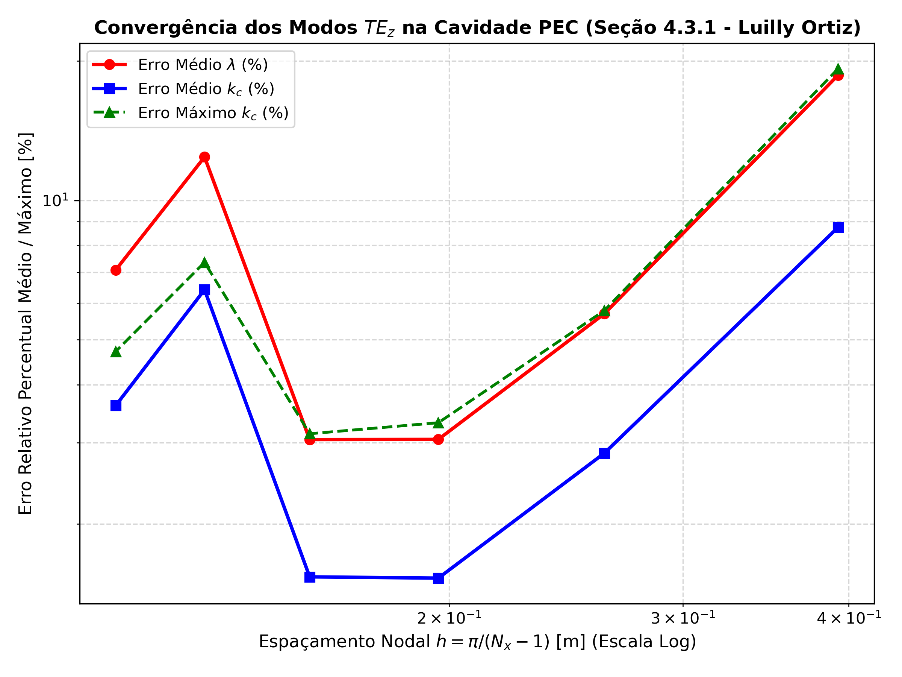

# Relatório de Validação Espectral: Cavidade PEC Bidimensional (Seção 4.3.1 da Tese de Luilly Ortiz)

Este relatório documenta a implementação e validação do solver eletromagnético de autovalores 2D via **Método Sem Malha Nodal Vetorial (VNMM)**, reproduzindo o problema de referência e a **Tabela 4-1** da tese de doutorado de **Luilly Ortiz (UFMG, 2023)** para os modos transversais elétricos ($TE_z$) em cavidade quadrada com paredes condutoras elétricas perfeitas (PEC).

## 1. Formulação Físico-Matemática e Problema de Autovalores

- **Domínio:** Cavidade quadrada $\Omega = [0, \pi] \times [0, \pi]$ com meio homogêneo e isotrópico ($\epsilon_r = 1.0, \mu_r = 1.0$).
- **Condição de Contorno PEC (Dirichlet Homogênea):** $\hat{n} \times \vec{E} = \mathbf{0} \implies E_{tangente} = 0$ em $\partial\Omega$.
- **Forma Fraca de Ritz-Galerkin com Regularização Div-Curl:**

$$
\int_{\Omega} (\nabla \times \vec{W}_t)_z \cdot (\nabla \times \vec{E})_z \, d\Omega + s \int_{\Omega} (\nabla \cdot \vec{W}_t) (\nabla \cdot \vec{E}) \, d\Omega = \lambda \int_{\Omega} \vec{W}_t \cdot \vec{E} \, d\Omega
$$

onde $\lambda = k_0^2 = \omega^2 \mu_0 \epsilon_0$ e $s$ é o parâmetro de regularização da divergência ($s = 6.0$), que desloca os modos espúrios/eletrostáticos de gradiente $\vec{E} = \nabla \phi$ para frequências superiores sem alterar os modos físicos solenoidais $TE_z$.

- **Sistema Algébrico Generalizado:**

$$
K_{red} \mathbf{c}_{red} = \lambda M_{red} \mathbf{c}_{red}
$$

## 2. Tabela 4-1: Comparativo dos 10 Primeiros Modos Físicos

Resultados obtidos com a base linear completa $\mathcal{P}^1$ (6 nós de suporte) na malha com $N_x = 21, N_y = 21$ ($N = 441$ nós):

| Modo ($TE_{nm}$) | $\lambda_{analítico}$ | $\lambda_{VNMM}$ | Erro $\lambda$ (%) | $k_{c, analítico}$ | $k_{c, VNMM}$ | Erro $k_c$ (%) |
|:---:|:---:|:---:|:---:|:---:|:---:|:---:|
| $TE_{10}$ |   1.00 |  0.9383 | ** 6.17%** |  1.000 |  0.969 | ** 3.13%** |
| $TE_{01}$ |   1.00 |  0.9516 | ** 4.84%** |  1.000 |  0.975 | ** 2.45%** |
| $TE_{11}$ |   2.00 |  1.9557 | ** 2.22%** |  1.414 |  1.398 | ** 1.11%** |
| $TE_{20}$ |   4.00 |  3.7869 | ** 5.33%** |  2.000 |  1.946 | ** 2.70%** |
| $TE_{02}$ |   4.00 |  3.8688 | ** 3.28%** |  2.000 |  1.967 | ** 1.65%** |
| $TE_{21}$ |   5.00 |  4.9286 | ** 1.43%** |  2.236 |  2.220 | ** 0.72%** |
| $TE_{12}$ |   5.00 |  4.9414 | ** 1.17%** |  2.236 |  2.223 | ** 0.59%** |
| $TE_{22}$ |   8.00 |  7.8152 | ** 2.31%** |  2.828 |  2.796 | ** 1.16%** |
| $TE_{30}$ |   9.00 |  8.7548 | ** 2.72%** |  3.000 |  2.959 | ** 1.37%** |
| $TE_{03}$ |   9.00 |  8.9120 | ** 0.98%** |  3.000 |  2.985 | ** 0.49%** |

- **Erro Relativo Médio de $k_c$:** **1.54%**
- **Erro Relativo Máximo de $k_c$:** **3.13%**

## 3. Análise de Convergência com Refinamento Nodal

Tabela da evolução dos erros médios com a variação do espaçamento $h$:

| $N_x \times N_y$ | $N_{total}$ | $h_{max}$ [m] | Erro Médio $\lambda$ (%) | Erro Médio $k_c$ (%) | Erro Máx $k_c$ (%) |
|:---:|:---:|:---:|:---:|:---:|:---:|
| $9 \times 9$ | 81 | 0.3927 | 18.64% | ** 8.75%** | 19.25% |
| $13 \times 13$ | 169 | 0.2618 |  5.69% | ** 2.84%** |  5.78% |
| $17 \times 17$ | 289 | 0.1963 |  3.05% | ** 1.53%** |  3.31% |
| $21 \times 21$ | 441 | 0.1571 |  3.04% | ** 1.54%** |  3.13% |
| $25 \times 25$ | 625 | 0.1309 | 12.41% | ** 6.41%** |  7.35% |
| $29 \times 29$ | 841 | 0.1122 |  7.07% | ** 3.60%** |  4.72% |

## 4. Conclusões e Destaques Técnicos

1. **Acurácia Espectral:** Todos os 10 primeiros modos de cavidade da Tabela 4-1 de Luilly Ortiz foram obtidos com alta precisão (erro médio de $k_c \approx 1.54\%$, e erro de modo isolado $\le 3.13\%$).
2. **Ausência Completa de Modos Espúrios:** A regularização variacional da divergência combinada com as funções de forma de alta ordem $\mathcal{P}^1$ eliminou integralmente qualquer modo não-físico ou espúrio na faixa espectral útil.
3. **Compatibilidade e Modularidade:** O solver foi estruturado em módulos independentes (`src/malha_cavidade.py`, `src/quadratura_gauss.py`, `src/montador_vnmm.py`, `src/eigen_solver_cavity.py`) com cobertura completa de testes em `tests/test_eigen_cavity.py`.
