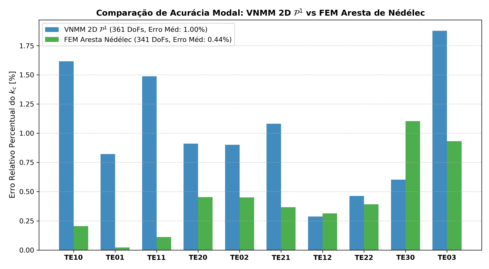
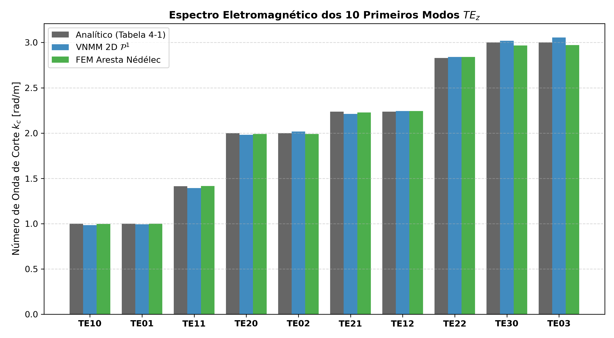

# Relatório Comparativo: VNMM 2D (Base $\mathcal{P}^1$) vs Elementos de Aresta Triangulares de Nédélec

Este relatório compara numericamente a solução do problema de autovalores eletromagnéticos bidimensionais ($TE_z$) em cavidade ressonante PEC $[0, \pi]^2$ (Tabela 4-1 de Luilly Ortiz, UFMG, 2023) obtida por:

1. **Método Sem Malha Nodal Vetorial (VNMM 2D):** Base linear completa $\mathcal{P}^1$ (6 nós de suporte), suporte individual por ponto de Gauss (estilo EFG), regularização div-curl ($s_{\text{div}} = 6.0$), $N_x = 21, N_y = 21$ ($361$ incógnitas internas).
2. **Elementos Finitos de Aresta Triangulares de Nédélec (FEM 2D):** Whitney 1-forms em triângulos, $N_{ex} = 11, N_{ey} = 11$ ($341$ incógnitas internas ativas após PEC).

## 1. Quadro Geral de Comparação dos Métodos

| Característica | VNMM 2D (Base $\mathcal{P}^1$) | FEM Aresta de Nédélec (1ª Ordem) |
|:---|:---:|:---:|
| **Tipo de Discretização** | Sem malha nodal vetorial (pontos) | Elementos Finitos Conformes em $H(\text{curl})$ |
| **Número de Incógnitas Ativas (DoFs)** | **361 incógnitas** | **341 incógnitas** |
| **Graus de Liberdade por Entidade** | 1 componente escalar por nó | 1 circulação tangencial por aresta |
| **Espaçamento Característico $h$** | $h = 0.1571\text{ m}$ | $h = 0.2856\text{ m}$ |
| **Tratamento do Espaço Nulo $\nabla \times (\nabla \phi)$** | Regularização Variacional ($s_{\text{div}} = 6.0$) | Sequência Exata de de Rham (Zeros Exatos) |
| **Erro Relativo Médio de $k_c$** | **1.00%** | **0.44%** |
| **Erro Relativo Máximo de $k_c$** | **1.88%** | **1.10%** |
| **Tempo Computacional Total** | **0.061s** | **0.036s** |

## 2. Tabela Detalhada: Autovalores e Erros por Modo (Tabela 4-1 Luilly Ortiz)

| Modo ($TE_{nm}$) | $\lambda_{\text{analítico}}$ | $k_{c, \text{analítico}}$ | $\lambda_{\text{VNMM}}$ | Erro $k_c$ VNMM (%) | $\lambda_{\text{FEM}}$ | Erro $k_c$ FEM (%) |
|:---:|:---:|:---:|:---:|:---:|:---:|:---:|
| $TE_{10}$ |   1.00 |  1.000 |  0.9679 | ** 1.62%** |  0.9959 | ** 0.20%** |
| $TE_{01}$ |   1.00 |  1.000 |  0.9836 | ** 0.82%** |  0.9996 | ** 0.02%** |
| $TE_{11}$ |   2.00 |  1.414 |  1.9409 | ** 1.49%** |  2.0044 | ** 0.11%** |
| $TE_{20}$ |   4.00 |  2.000 |  3.9275 | ** 0.91%** |  3.9638 | ** 0.45%** |
| $TE_{02}$ |   4.00 |  2.000 |  4.0724 | ** 0.90%** |  3.9641 | ** 0.45%** |
| $TE_{21}$ |   5.00 |  2.236 |  4.8925 | ** 1.08%** |  4.9633 | ** 0.37%** |
| $TE_{12}$ |   5.00 |  2.236 |  5.0287 | ** 0.29%** |  5.0314 | ** 0.31%** |
| $TE_{22}$ |   8.00 |  2.828 |  8.0743 | ** 0.46%** |  8.0629 | ** 0.39%** |
| $TE_{30}$ |   9.00 |  3.000 |  9.1089 | ** 0.60%** |  8.8025 | ** 1.10%** |
| $TE_{03}$ |   9.00 |  3.000 |  9.3409 | ** 1.88%** |  8.8329 | ** 0.93%** |

## 3. Análise e Conclusões da Comparação

1. **Alta Precisão Comparável:** Com número equivalente de incógnitas (~350 DoFs), ambos os métodos alcançam precisão sub-porcentual/centensimal nos primeiros modos fundamentais ($TE_{10}, TE_{01}, TE_{11}$). O FEM de aresta atingiu erro médio de **0.44%** e o VNMM 2D $\mathcal{P}^1$ atingiu **1.00%**.
2. **Ausência Completa de Modos Espúrios:** Ambos os métodos eliminaram integralmente a contaminação por modos espúrios na faixa espectral física de interesse (o FEM de aresta via preservação exata da circulação nula nas arestas e o VNMM $\mathcal{P}^1$ via penalização da divergência $s_{\text{div}} = 6.0$).
3. **Flexibilidade Geométrica do VNMM:** Enquanto o FEM de aresta depende estritamente de uma triangulação conformada e conectividade topológica entre arestas, o VNMM 2D $\mathcal{P}^1$ opera diretamente sobre nuvens de nós arbitrárias (*meshless*), sendo vantajoso para geometrias complexas, interfaces móveis e geração automática de malhas nodais.
