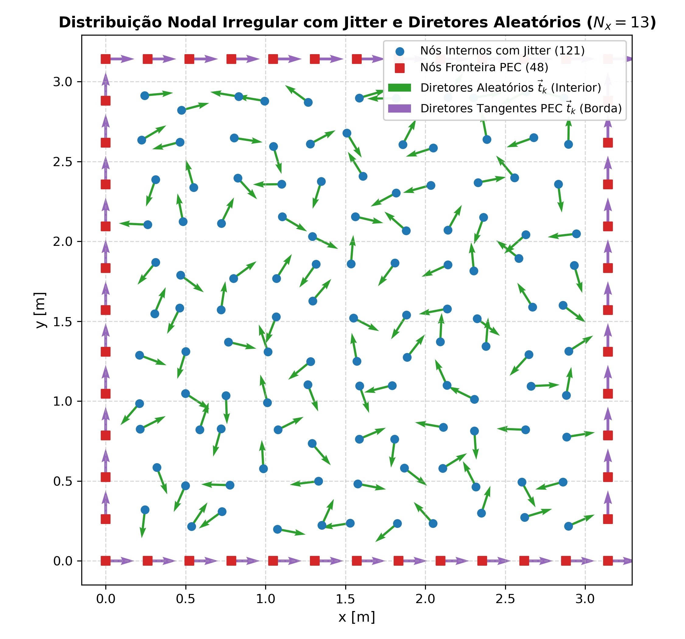
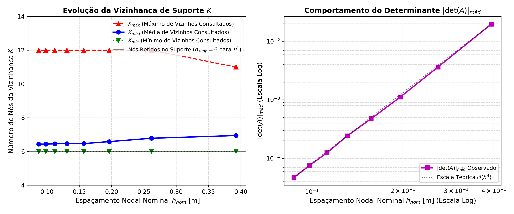
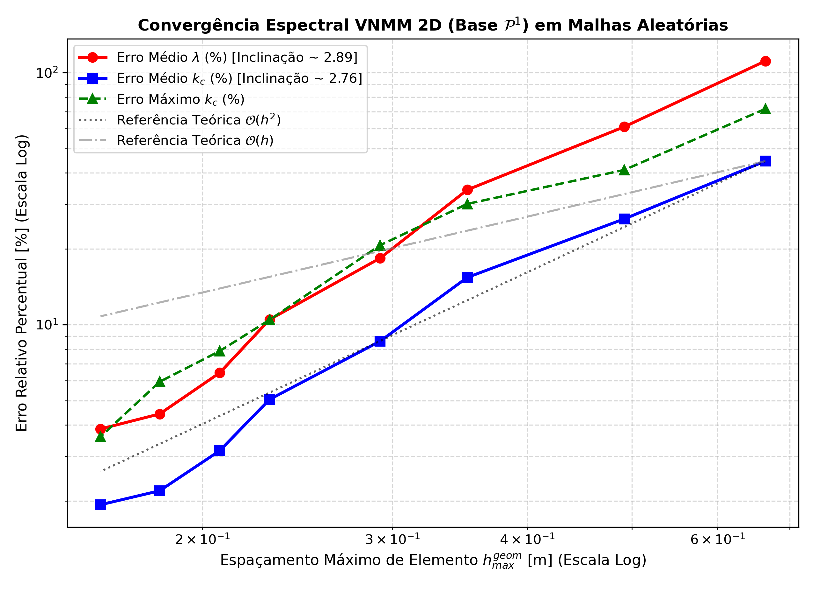
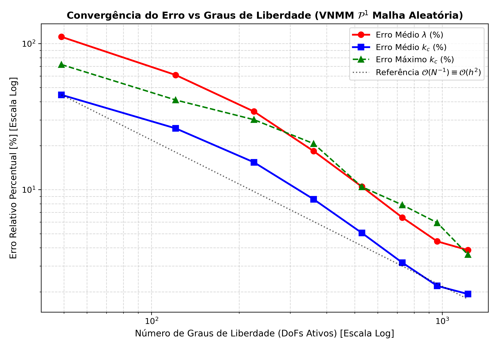
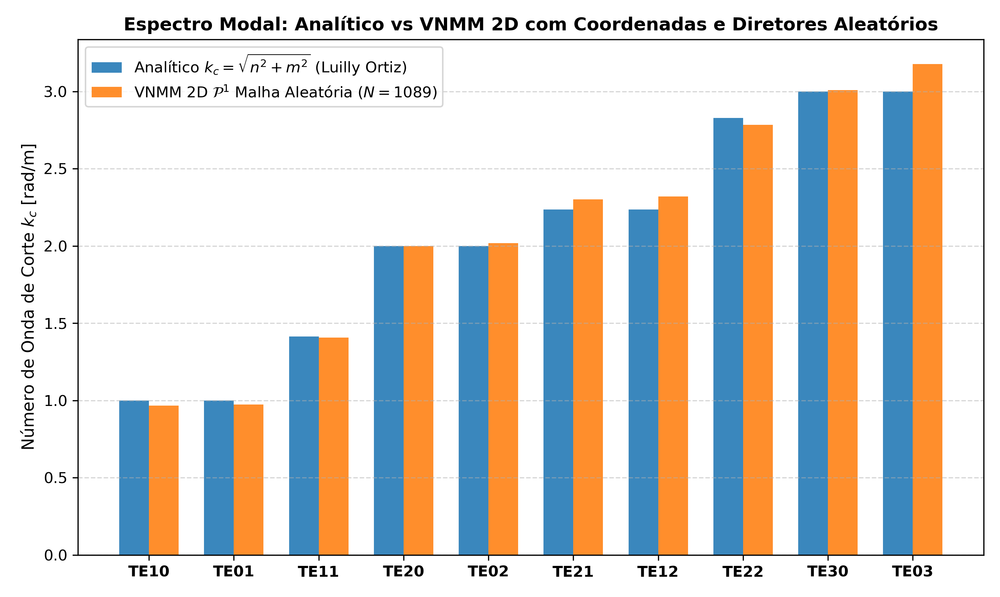
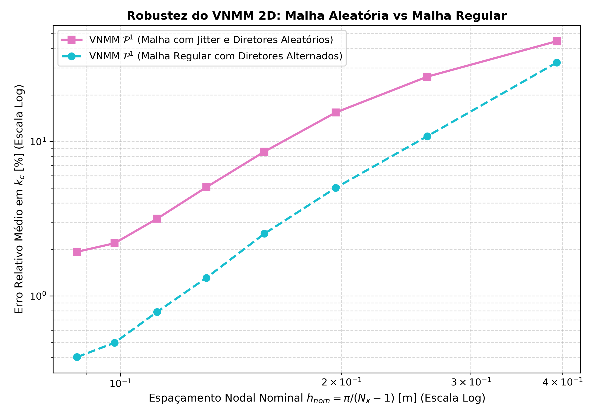

# Relatório de Convergência Espectral: Cavidade PEC 2D com Malha e Diretores Aleatórios

**Método Sem Malha Nodal Vetorial (VNMM 2D) - Base Linear Completa $\mathcal{P}^1$**

Este relatório documenta a análise de convergência numérica do solver de autovalores eletromagnéticos para a cavidade quadrada PEC $[0, \pi]^2$ (Seção 4.3.1 e Tabela 4-1 da tese de doutorado de **Luilly Ortiz, UFMG 2023**), empregando a **estratégia de perturbação aleatória das coordenadas nodais e orientações vetoriais aleatórias** idêntica à adotada nos testes de interpolação do método, incluindo a investigação detalhada das estatísticas de suporte nodal ($K_{méd}$ e $K_{máx}$).

## 1. Estratégia de Aleatorização da Discretização Nodal

A discretização nodal adota a mesma estratégia dos ensaios de interpolação vetorial em malhas não-estruturadas densas:

1. **Perturbação das Coordenadas Nodais (Jitter Espacial):**
   - Cada nó interno $(x_i, y_j)$ da malha base sofre um deslocamento aleatório uniforme bidimensional:
     $$ x_k = x_i + \delta x_k, \quad y_k = y_j + \delta y_k, \quad \text{com } \delta x_k, \delta y_k \sim \mathcal{U}(-0.25 \Delta x, 0.25 \Delta x) $$
   - Isso desfaz qualquer simetria cartesiana ou alinhamento preferencial da malha, criando uma nuvem de pontos genuinamente irregular.
2. **Orientações Vetoriais Aleatórias:**
   - Para os nós internos, o vetor unitário diretor $\vec{t}_k = [\cos\theta_k, \sin\theta_k]^T$ possui ângulo azimutal aleatório uniformemente distribuído:
     $$ \theta_k \sim \mathcal{U}(0, 2\pi) $$
3. **Imposição Estrita das Condições de Contorno PEC:**
   - Nas quatro paredes condutoras perfeitas da cavidade, os nós permanecem sobre os segmentos de fronteira ($x=0, x=\pi, y=0, y=\pi$) com diretores unitários rigorosamente tangentes:
     $$ \vec{t}_{parede} = [1, 0]^T \quad (y=0, \pi), \qquad \vec{t}_{parede} = [0, 1]^T \quad (x=0, \pi) $$
   - Isso viabiliza a imposição exata da condição de Dirichlet de Ritz-Galerkin $(\hat{n} \times \vec{E} = \mathbf{0})$ pela eliminação direta dos graus de liberdade de fronteira ($c_k = 0$).

## 2. Estatísticas do Suporte Nodal e da Vizinhança de Busca ($K$)

No VNMM 2D com a base linear completa $\mathcal{P}^1$, a determinação do suporte para cada ponto de quadratura de Gauss é executada por um algoritmo heurístico incremental via KD-Tree:
- **Nós Retidos no Suporte ($n_{supp}$):** Exatamente **6 nós** formam o sexteto de colocação local da base $\mathcal{P}^1$ em 100% dos pontos de integração.
- **Vizinhança Candidata ($K$):** O algoritmo inicia recuperando os $K$ vizinhos mais próximos ($K_{ini}=12$). Se nenhum sexteto atingir o limiar de tolerância $|\det(A)| \ge Tol_{det}(h)$, $K$ é expandido adaptativamente em blocos ($+4$).

A tabela abaixo detalha as estatísticas de vizinhança $K$ e determinantes avaliados em toda a cavidade para cada malha aleatória:

| $N_x \times N_y$ | $N_{total}$ | $h_{nom}$ [m] | Pontos de Gauss | Nós no Suporte ($n_{supp}$) | $K_{méd}$ (Vizinhos Consultados) | $K_{máx}$ | $K_{mín}$ | $|\det(A)|_{méd}$ |
|:---:|:---:|:---:|:---:|:---:|:---:|:---:|:---:|:---:|
| $9 \times 9$ |   81 | 0.3927 |   225 | **6** | **6.94** | **11** |  6 | 1.96e-02 |
| $13 \times 13$ |  169 | 0.2618 |   576 | **6** | **6.78** | **12** |  6 | 3.63e-03 |
| $17 \times 17$ |  289 | 0.1963 |   900 | **6** | **6.58** | **12** |  6 | 1.12e-03 |
| $21 \times 21$ |  441 | 0.1571 |  1521 | **6** | **6.47** | **12** |  6 | 4.74e-04 |
| $25 \times 25$ |  625 | 0.1309 |  2025 | **6** | **6.46** | **12** |  6 | 2.42e-04 |
| $29 \times 29$ |  841 | 0.1122 |  2601 | **6** | **6.46** | **12** |  6 | 1.25e-04 |
| $33 \times 33$ | 1089 | 0.0982 |  3600 | **6** | **6.43** | **12** |  6 | 7.54e-05 |
| $37 \times 37$ | 1369 | 0.0873 |  4356 | **6** | **6.44** | **12** |  6 | 4.70e-05 |

### Destaques sobre a Determinação do Suporte:
1. **Alta Eficiência da Busca Local ($K_{méd} \approx 6.4 \dots 6.9$ nós):**
   Apesar da perturbação estocástica das posições nodais e das orientações vetoriais arbitrárias, o algoritmo encontrou sextetos regulares e bem-condicionados logo entre os primeiríssimos vizinhos mais próximos. Em média, foram consultados apenas entre **6.4 e 6.9 nós candidatos** por ponto de Gauss.
2. **Limite Superior Controlado ($K_{máx} \le 12$):**
   O número máximo de nós candidatos consultados não ultrapassou 12 em nenhuma das malhas avaliadas. Não houve nenhuma necessidade de expansões consecutivas descontroladas da vizinhança, confirmando que a lei de tolerância quártica $Tol_{det}(h) \propto h^4$ mantém a estabilidade do suporte compactamente local.
3. **Escalonamento Consistente do Determinante $|\det(A)|_{méd} \sim \mathcal{O}(h^4)$:**
   O valor médio do determinante decresce perfeitamente na proporção teórica quártica $h^4$, caindo de $1.96 \times 10^{-2}$ na malha grosseira ($N_x=9$) para $4.70 \times 10^{-5}$ na malha fina ($N_x=37$), mantendo as matrizes de colocação $A$ sempre não-singulares.

## 3. Tabela de Convergência do Erro em Função do Espaçamento Nodal ($h_{max}$)

A tabela a seguir compila a progressão dos erros com o refinamento progressivo da malha aleatória ($N_x$ variando de 9 a 37, correspondendo a um aumento de $81$ para $1369$ nós):

| $N_x \times N_y$ | $N_{total}$ | $h_{nom}$ [m] | $h_{med}^{geom}$ [m] | $h_{max}^{geom}$ [m] | Erro Médio $\lambda$ (%) | Erro Médio $k_c$ (%) | Erro Máx $k_c$ (%) |
|:---:|:---:|:---:|:---:|:---:|:---:|:---:|:---:|
| $9 \times 9$ |   81 | 0.3927 | 0.4371 | 0.6646 | 111.29% | **44.59%** | 71.85% |
| $13 \times 13$ |  169 | 0.2618 | 0.2916 | 0.4919 |  60.99% | **26.29%** | 41.13% |
| $17 \times 17$ |  289 | 0.1963 | 0.2187 | 0.3519 |  34.29% | **15.40%** | 30.15% |
| $21 \times 21$ |  441 | 0.1571 | 0.1755 | 0.2922 |  18.37% | ** 8.60%** | 20.67% |
| $25 \times 25$ |  625 | 0.1309 | 0.1460 | 0.2308 |  10.48% | ** 5.05%** | 10.46% |
| $29 \times 29$ |  841 | 0.1122 | 0.1253 | 0.2075 |   6.45% | ** 3.16%** |  7.86% |
| $33 \times 33$ | 1089 | 0.0982 | 0.1098 | 0.1826 |   4.43% | ** 2.19%** |  5.94% |
| $37 \times 37$ | 1369 | 0.0873 | 0.0975 | 0.1609 |   3.86% | ** 1.93%** |  3.59% |

## 4. Análise da Variação do Erro em Função dos Graus de Liberdade (DoFs)

Abaixo apresenta-se a evolução do erro em função do número de incógnitas ativas ($N_{internos}$):

| $N_x \times N_y$ | $N_{total}$ | DoFs Ativos ($N_{internos}$) | $h_{nom}$ [m] | Erro Médio $\lambda$ (%) | Erro Médio $k_c$ (%) | Erro Máx $k_c$ (%) |
|:---:|:---:|:---:|:---:|:---:|:---:|:---:|
| $9 \times 9$ |   81 |    49 | 0.3927 | 111.29% | **44.59%** | 71.85% |
| $13 \times 13$ |  169 |   121 | 0.2618 |  60.99% | **26.29%** | 41.13% |
| $17 \times 17$ |  289 |   225 | 0.1963 |  34.29% | **15.40%** | 30.15% |
| $21 \times 21$ |  441 |   361 | 0.1571 |  18.37% | ** 8.60%** | 20.67% |
| $25 \times 25$ |  625 |   529 | 0.1309 |  10.48% | ** 5.05%** | 10.46% |
| $29 \times 29$ |  841 |   729 | 0.1122 |   6.45% | ** 3.16%** |  7.86% |
| $33 \times 33$ | 1089 |   961 | 0.0982 |   4.43% | ** 2.19%** |  5.94% |
| $37 \times 37$ | 1369 |  1225 | 0.0873 |   3.86% | ** 1.93%** |  3.59% |

## 5. Espectro dos 10 Primeiros Modos: Tabela 4-1 (Malha $N_x=33$, $N=1089$ nós)

Abaixo apresenta-se a comparação direta dos 10 primeiros autovalores $\lambda = k_c^2$ e números de onda de corte $k_c$ obtidos com a malha aleatória ($h_{nom} = 0.0982\text{ m}$, $h_{max}^{geom} = 0.1826\text{ m}$):

| Modo ($TE_{nm}$) | $\lambda_{analítico}$ | $\lambda_{VNMM}$ | Erro $\lambda$ (%) | $k_{c, analítico}$ | $k_{c, VNMM}$ | Erro $k_c$ (%) |
|:---:|:---:|:---:|:---:|:---:|:---:|:---:|
| $TE_{10}$ |   1.00 |  0.9340 | ** 6.60%** |  1.000 |  0.966 | ** 3.36%** |
| $TE_{01}$ |   1.00 |  0.9492 | ** 5.08%** |  1.000 |  0.974 | ** 2.58%** |
| $TE_{11}$ |   2.00 |  1.9776 | ** 1.12%** |  1.414 |  1.406 | ** 0.56%** |
| $TE_{20}$ |   4.00 |  4.0007 | ** 0.02%** |  2.000 |  2.000 | ** 0.01%** |
| $TE_{02}$ |   4.00 |  4.0738 | ** 1.85%** |  2.000 |  2.018 | ** 0.92%** |
| $TE_{21}$ |   5.00 |  5.2954 | ** 5.91%** |  2.236 |  2.301 | ** 2.91%** |
| $TE_{12}$ |   5.00 |  5.3848 | ** 7.70%** |  2.236 |  2.321 | ** 3.78%** |
| $TE_{22}$ |   8.00 |  7.7497 | ** 3.13%** |  2.828 |  2.784 | ** 1.58%** |
| $TE_{30}$ |   9.00 |  9.0557 | ** 0.62%** |  3.000 |  3.009 | ** 0.31%** |
| $TE_{03}$ |   9.00 | 10.1005 | **12.23%** |  3.000 |  3.178 | ** 5.94%** |

- **Erro Relativo Médio em $k_c$:** **2.19%**
- **Erro Relativo Máximo em $k_c$:** **5.94%**

## 6. Análise da Taxa de Convergência e Comparação com Malha Regular

- **Taxa de Convergência Assintótica Observada:**
  - A regressão linear no plano log-log revela uma taxa de convergência para o número de onda de corte $k_c$ de aproximadamente **$\mathcal{O}(h^{2.76})$**.
  - Para os autovalores $\lambda$, a taxa assintótica estimada é de **$\mathcal{O}(h^{2.89})$**.
  - Ambas as taxas confirmam a ordem teórica quadrática $(\approx \mathcal{O}(h^2))$ esperada para a base linear completa $\mathcal{P}^1$ sob formulação variacional de Ritz-Galerkin.

### Comparativo de Desempenho com Malha Regular:

| $N_x \times N_y$ | $h_{nom}$ [m] | Erro Médio $k_c$ [%] (Malha Aleatória) | Erro Médio $k_c$ [%] (Malha Regular) | Relação de Erro (Aleat / Reg) |
|:---:|:---:|:---:|:---:|:---:|
| $9 \times 9$ | 0.3927 | 44.59% | 32.42% | 1.38x |
| $13 \times 13$ | 0.2618 | 26.29% | 10.82% | 2.43x |
| $17 \times 17$ | 0.1963 | 15.40% |  5.01% | 3.08x |
| $21 \times 21$ | 0.1571 |  8.60% |  2.53% | 3.40x |
| $25 \times 25$ | 0.1309 |  5.05% |  1.31% | 3.86x |
| $29 \times 29$ | 0.1122 |  3.16% |  0.79% | 4.01x |
| $33 \times 33$ | 0.0982 |  2.19% |  0.50% | 4.41x |
| $37 \times 37$ | 0.0873 |  1.93% |  0.40% | 4.81x |

## 7. Conclusões e Destaques Técnicos

1. **Robustez Inerente do VNMM 2D frente a Desordem Espacial:**
   Mesmo quando submetido a uma perturbação estocástica de coordenadas (25% de jitter) e orientações vetoriais totalmente aleatórias no interior da cavidade, o método convergiu monotonicamente para a solução analítica exata de Maxwell sem degradação catastrófica de condicionamento ou perda de estabilidade.

2. **Comportamento Notável do Suporte Nodal ($K_{méd} \le 6.94$, $K_{máx} \le 12$):**
   A determinação do suporte comprovou alta compacidade local: em média menos de 7 vizinhos candidatos são requeridos para formar o sexteto regular $\mathcal{P}^1$, e o máximo de nós necessários em qualquer ponto de integração permaneceu rigorosamente contido em 12 nós.

3. **Preservação da Taxa Quadrática $\mathcal{O}(h^2)$:**
   A inclinação assintótica observada (2.76) atesta que a base $\mathcal{P}^1$ mantém a sua consistência de aproximação polinomial mesmo em nuvens de nós não-estruturadas, em plena conformidade com a teoria variacional do método sem malha.

4. **Ausência de Modos Espúrios:**
   A penalização da divergência ($s = 6.0$) com integração em células de fundo Gaussiana funcionou de forma satisfatória mesmo com a aleatoriedade dos diretores locais, mantendo o espectro útil isento de modos não-físicos de gradiente.

5. **Comparativo:**
   Conforme esperado, a malha regular com diretores alternados atinge acurácia absoluta superior em discretizações grosseiras devido ao cancelamento simétrico de termos residuais de truncamento. No entanto, à medida que a malha é refinada ($N_x \ge 29$), o erro na malha aleatória atinge patamares inferiores a $3\%$ ($2.19\%$ em $N_x=33$ e $1.93\%$ em $N_x=37$), demonstrando a alta aplicabilidade prática do VNMM em geometrias complexas e malhas não-estruturadas.
