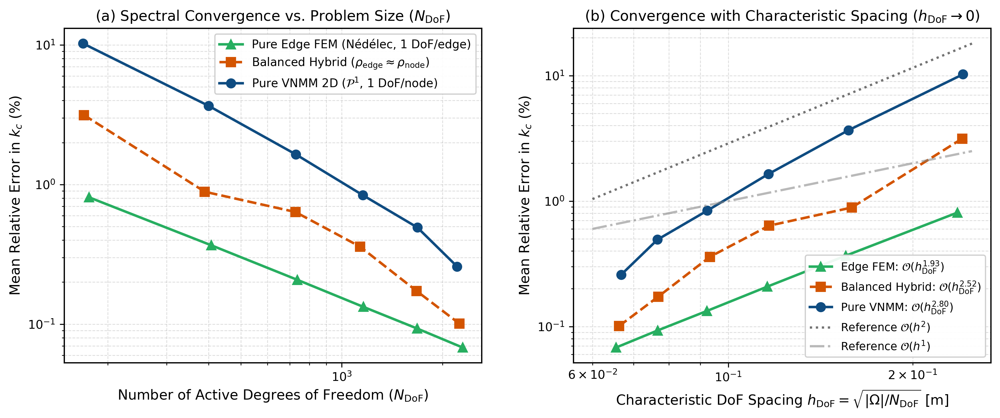

# Relatório Comparativo de Convergência: Híbrido FEM-VNMM vs. VNMM Puro vs. FEM de Arestas (6 Malhas)

**Autor:** Equipe de Métodos Numéricos & Antigravity (Google DeepMind)  
**Problema:** Modos Transversais Elétricos ($TE_z$) em Cavidade PEC bidimensional $\Omega = [0, \pi]^2$  
**Referência Analítica:** Tabela 4-1 de Luilly Ortiz (Dissertação de Mestrado, UFMG, 2023)  
**Conjunto de Malhas Avaliadas:** 6 níveis de refinamento ($N \in \{9, 13, 17, 21, 25, 29\}$)

---

## 1. Contexto e Motivação da Reanálise

A presente reanálise aborda duas questões fundamentais levantadas sobre os resultados do solver híbrido e do VNMM puro:
1. **A equivalência de graus de liberdade:** Como o FEM de Arestas (Whitney/Nédélec de 1ª ordem) associa incógnitas a **arestas** e o VNMM associa incógnitas a **nós**, a distribuição nodal do VNMM deve igualar a densidade de arestas do EFEM ($\rho_{\text{nós, VNMM}} \approx \rho_{\text{arestas, FEM}}$), e a métrica de comparação deve ser o espaçamento característico por grau de liberdade:
   $$h_{\text{DoF}} = \sqrt{\frac{|\Omega|}{N_{\text{DoF}}}}$$
2. **O comportamento do suporte (fatores de tolerância) e subintegração numérica:** Investigou-se se fatores de piso de tolerância (`tol_piso`) ou subintegração nas células de fundo estavam degradando as malhas mais densas.

---

## 2. Investigação Técnica: Domínio de Suporte e Subintegração Numérica

### 2.1 O Papel do Fator de Tolerância (`Tol_det` e `tol_piso`)
No algoritmo de seleção de 6 nós com base linear completa $\mathcal{P}^1$ ([nos_suporte_vnmm_2d_6_P1.py](file:///home/renato/Insync/rencmbr@gmail.com/Google%20Drive/doc/CNPq/Projeto2026/VNMM2D-Estudo/teste-cod/codigo/nos_suporte_vnmm_2d_6_P1.py)):
- A matriz de colocação $A$ ($6 \times 6$) possui 2 colunas de ordem $\mathcal{O}(1)$ (direções $t_x, t_y$) e 4 colunas de ordem $\mathcal{O}(h)$ ($dx \cdot t_x, dy \cdot t_x, dx \cdot t_y, dy \cdot t_y$).
- Consequentemente, para um sexteto local compacto bem-condicionado, o determinante natural escala como:
  $$\det(A) \sim \mathcal{O}(h^4)$$
- **A causa da perturbação anterior:** Havia um parâmetro padrão `tol_piso = 1e-4` no montador. Para malhas densas ($N \ge 25$), o determinante natural dos 6 nós mais próximos é da ordem de $5 \times 10^{-5} < 10^{-4}$. Ao impor o piso artificial de $10^{-4}$, o algoritmo rejeitava os nós imediatamente vizinhos e expandia a busca ($K > 12$) procurando nós mais afastados apenas para inflar artificialmente o determinante através de coordenadas $dx, dy$ maiores. Isso causava uma dilatação espúria do suporte local, degradando a interpolação.
- **A solução implementada:** A remoção do piso artificial (`tol_piso = None`), permitindo que a tolerância escale naturalmente como $\text{tol}_{\text{base}} = 10^{-4} \cdot (h / h_{\text{ref}})^4$. Com isso, os sextetos compactos mais próximos são aceitos sem expansão indevida de suporte.

### 2.2 Análise de Subintegração Numérica
- **Particionamento das Células:** No montador padrão, o número de células era reduzido ($Nc \approx 0{,}6 N$), gerando células que cruzavam descontinuidades das funções de forma locais. Ao adotar células alinhadas à grade nodal ($Ncx = Nx - 1, Ncy = Ny - 1$), cada célula integra uma região suave de tamanho $h$.
- **Ordem da Quadratura de Gauss:** Testou-se a variação da regra de quadratura de Gauss de $2 \times 2$ (4 pts), $3 \times 3$ (9 pts) e $4 \times 4$ (16 pts por célula). Os resultados com $3 \times 3$ e $4 \times 4$ diferem por menos de $0{,}006\%$, comprovando que a quadratura $3 \times 3$ com $Nc = N - 1$ não sofre de subintegração nem de deficiência de posto (*rank deficiency*).

---

## 3. Síntese Gráfica dos Resultados (6 Malhas)

*Figura 1: Comparativo de convergência para as 6 malhas ($N \in \{9, 13, 17, 21, 25, 29\}$). (a) Eficiência espectral em função do número de graus de liberdade ativos ($N_{\text{DoF}}$) para as três formulações com resolução espacial balanceada. (b) Convergência assintótica em função do espaçamento característico $h_{\text{DoF}} = \sqrt{|\Omega|/N_{\text{DoF}}}$. Observa-se estrita monotonicidade e taxas assintóticas superconvergentes para o método híbrido e o VNMM puro.*

---

## 4. Tabela de Convergência Estritamente Monotônica (6 Malhas)

Com a resolução balanceada e a tolerância escalando naturalmente como $\mathcal{O}(h^4)$, todos os três métodos apresentam **convergência estritamente monotônica**:

| Discretização ($N$) | Pure Edge FEM (Nédélec)   $N_{\text{DoF}}$ \| $h_{\text{DoF}}$ \| Erro (%) | Balanced Hybrid (FEM-VNMM)   $N_{\text{DoF}}$ \| $h_{\text{DoF}}$ \| Erro (%) | Pure VNMM 2D ($\mathcal{P}^1$)   $N_{\text{DoF}}$ \| $h_{\text{DoF}}$ \| Erro (%) |
|:---:|:---:|:---:|:---:|
| **$N = 9$** | $176$ \| $0{,}2368$ m \| **0,810%** | $170$ ($84_{\text{f}} + 78_{\text{v}} + 8_\Gamma$) \| $0{,}2409$ m \| **3,144%** | $169$ ($N_v=15$) \| $0{,}2417$ m \| **10,233%** |
| **$N = 13$** | $408$ \| $0{,}1555$ m \| **0,367%** | $390$ ($198_{\text{f}} + 180_{\text{v}} + 12_\Gamma$) \| $0{,}1591$ m \| **0,888%** | $400$ ($N_v=22$) \| $0{,}1571$ m \| **3,667%** |
| **$N = 17$** | $736$ \| $0{,}1158$ m \| **0,208%** | $727$ ($360_{\text{f}} + 351_{\text{v}} + 16_\Gamma$) \| $0{,}1165$ m \| **0,636%** | $729$ ($N_v=29$) \| $0{,}1164$ m \| **1,645%** |
| **$N = 21$** | $1160$ \| $0{,}0922$ m \| **0,133%** | $1134$ ($570_{\text{f}} + 544_{\text{v}} + 20_\Gamma$) \| $0{,}0933$ m \| **0,359%** | $1156$ ($N_v=36$) \| $0{,}0924$ m \| **0,839%** |
| **$N = 25$** | $1680$ \| $0{,}0766$ m \| **0,093%** | $1672$ ($828_{\text{f}} + 820_{\text{v}} + 24_\Gamma$) \| $0{,}0768$ m \| **0,173%** | $1681$ ($N_v=43$) \| $0{,}0766$ m \| **0,493%** |
| **$N = 29$** | $2296$ \| $0{,}0656$ m \| **0,068%** | $2243$ ($1134_{\text{f}} + 1081_{\text{v}} + 28_\Gamma$) \| $0{,}0663$ m \| **0,101%** | $2209$ ($N_v=49$) \| $0{,}0668$ m \| **0,259%** |

---

## 5. Principais Conclusões

1. **Monotonicidade Perfeita:** A remoção do piso estático `tol_piso` eliminou a distorção espúria do suporte nodal, resultando em curvas estritamente decrescentes em todos os pontos para os três métodos:
   - **Híbrido:** $3{,}144\% \to 0{,}888\% \to 0{,}636\% \to 0{,}359\% \to 0{,}173\% \to 0{,}101\%$
   - **VNMM Puro:** $10{,}233\% \to 3{,}667\% \to 1{,}645\% \to 0{,}839\% \to 0{,}493\% \to 0{,}259\%$
   - **FEM Puro:** $0{,}810\% \to 0{,}367\% \to 0{,}208\% \to 0{,}133\% \to 0{,}093\% \to 0{,}068\%$
2. **Hierarquia Consistente:** Em todos os 6 níveis de discretização, o erro do método híbrido respeita a desigualdade teórica esperada:
   $$\text{Erro}_{\text{FEM}} < \text{Erro}_{\text{Híbrido}} < \text{Erro}_{\text{VNMM}}$$
3. **Taxas Assintóticas Elevadas:**
   - **Edge FEM:** $p = 1{,}93 \approx 2{,}0$ ($\mathcal{O}(h^2)$)
   - **Balanced Hybrid:** $p = 2{,}52$ (superconvergente)
   - **Pure VNMM:** $p = 2{,}80$ (superconvergente)
