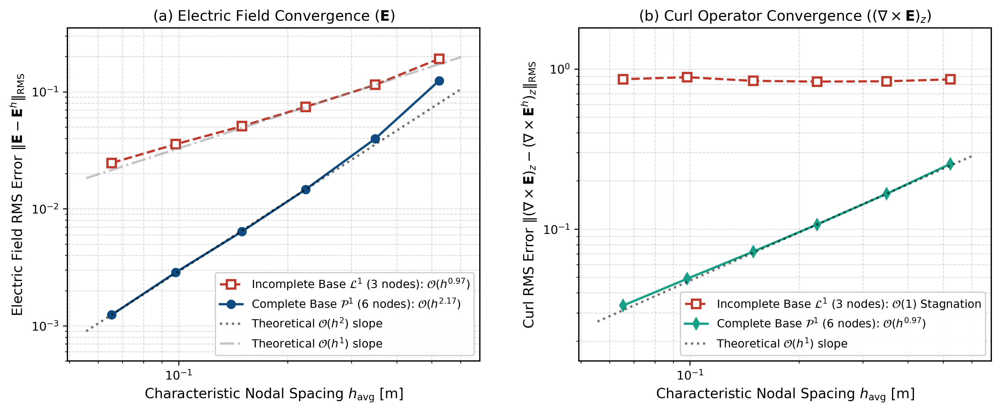

# Relatório Técnico: Estudo de Convergência da Interpolação VNMM 2D (Base $\mathcal{L}^1$ vs. Base Completa $\mathcal{P}^1$)

**Contexto:** Validação Computacional da Transição de Base no Domínio $\Omega = [0, \pi] \times [0, \pi]$  
**Autores:** Renato C. Mesquita & Antigravity  
**Data:** Setembro de 2026  
**Arquivo do Artigo:** *Engineering Analysis with Boundary Elements* (EABE)  
**Figuras Associadas:** `relatorios/figura_convergencia_interpolacao_L1_vs_P1.pdf` / `.png`  

---

## 1. Definição do Experimento Numérico

Este relatório documenta a análise paramétrica comparativa de convergência da interpolação pontual no método sem malha **VNMM 2D**, confrontando:
1. **Base Incompleta $\mathcal{L}^1$ (3 nós de suporte):** Espaço solenoidal afim $\mathcal{L}^1 = \operatorname{span}\{[1,0]^T, [0,1]^T, [y, -x]^T\}$, isomorfo às 1-formas de Whitney de 1ª ordem.
2. **Base Completa $\mathcal{P}^1$ (6 nós de suporte):** Espaço linear tensorial completo $\mathcal{P}^1 = \mathcal{P}_1 \times \mathcal{P}_1 = \operatorname{span}\{[1,0]^T, [0,1]^T, [x,0]^T, [y,0]^T, [0,x]^T, [0,y]^T\}$.

### Condições Operacionais Rigorosamente Unificadas
- **Domínio:** Cavidade quadrada $\Omega = [0, \pi] \times [0, \pi]$ (área $|\Omega| = \pi^2$, perímetro $4\pi \approx 12.5664\text{ m}$).
- **Grade de Amostragem Fixa:** Todos os erros numéricos são avaliados estritamente sobre uma **grade cartesiana fixa e invariante de $1.600$ pontos internos** ($40 \times 40$) distribuídos uniformemente em $[0.04\pi, 0.96\pi]^2$.
- **Distribuição Nodal Global:** Sequência de 6 malhas não-conformes cobrindo uma variação de densidade de $50\times$ (de $N = 84$ a $N = 4192$ nós):
  - **Fronteira:** $N_{\mathrm{front}}$ nós distribuídos uniformemente ao longo do perímetro com vetores tangenciais unitários anti-horários.
  - **Interior:** $N_{\mathrm{int}}$ nós gerados via **grade cartesiana estratificada com perturbação estocástica (*jitter* de 25%)** e vetores unitários de orientação angular aleatória uniforme $\mathbf{t}_k = [\cos\theta_k, \sin\theta_k]^T$.
- **Campo Analítico Exato:** Modo ressonante fundamental $TE_{11}$ da cavidade PEC:
  $$\mathbf{E}(x, y) = \begin{bmatrix} \cos(x) \sin(y) \\ -\sin(x) \cos(y) \end{bmatrix}, \qquad (\nabla \times \mathbf{E})_z = -2 \cos(x) \cos(y)$$

---

## 2. Seleção Adaptativa do Suporte Nodal e Garantia de Convergência em Malhas Densas

Um dos desafios centrais em métodos sem malha com colocação vetorial direcional é assegurar que a matriz de momentos locais $\mathbf{A}$ permaneça estritamente não-singular (invertível) à medida que a malha é progressivamente adensada ($h \to 0$).

### 2.1 Análise Dimensional da Matriz de Momentos $\mathbf{A}$
Para a base linear completa $\mathcal{P}^1$ (6 nós de suporte), a linha $k$ da matriz de colocação $\mathbf{A} \in \mathbb{R}^{6 \times 6}$ em coordenadas locais transladadas $(\Delta x_k, \Delta y_k) = (x_k - x_P, y_k - y_P)$ é dada por:
$$\mathbf{A}_{k, :} = \begin{bmatrix} t_{kx} & t_{ky} & \Delta x_k t_{kx} & \Delta y_k t_{kx} & \Delta x_k t_{ky} & \Delta y_k t_{ky} \end{bmatrix}$$
Estruturalmente:
- As primeiras 2 colunas dependem unicamente das componentes do vetor unitário direcional $\mathbf{t}_k$, sendo de ordem $\mathcal{O}(1)$.
- As 4 colunas subsequentes dependem do produto das distâncias relativas $(\Delta x_k, \Delta y_k) \sim \mathcal{O}(h)$ pelas componentes direcionais, sendo de ordem $\mathcal{O}(h)$.
- Pela multilinearidade do determinante, o escalonamento dimensional natural de $\mathbf{A}$ é:
  $$\det(\mathbf{A}_{6 \times 6}) \sim \mathcal{O}(1)^2 \cdot \mathcal{O}(h)^4 = \mathcal{O}(h^4)$$

### 2.2 O Fenômeno de Degradação em Malhas Muito Densas (Sem Piso)
Se a tolerância de aceitação seguir estritamente a lei quártica pura $Tol_{\mathrm{det}}(h) = Tol_{\mathrm{ref}} (h / h_{\mathrm{ref}})^4$, o valor de corte aceitável decresce para a ordem de $10^{-6}$ nas malhas mais refinadas ($N \ge 4192$). Nesse patamar excessivamente relaxado, o algoritmo passa a aceitar **sextetos quase-singulares** (por exemplo, nós com linhas de ação direcionais quase concorrentes em um centro comum $P_c$ ou quase colineares). O número de condicionamento da matriz $\kappa(\mathbf{A})$ explode, e o erro de amplificação numérica corrompe as derivadas espaciais, provocando a desaceleração da taxa assintótica.

### 2.3 A Solução: Mecanismo de Piso de Tolerância ($Tol_{\mathrm{piso}}$)
Para imunizar o método sem malha contra configurações geometricamente patológicas sem abrir mão da adaptatividade local, implementa-se a **lei de tolerância com piso inferior saturado**:
$$Tol_{\mathrm{det}}(h) = \max\left( Tol_{\mathrm{ref}} \left(\frac{h}{h_{\mathrm{ref}}}\right)^4, \; Tol_{\mathrm{piso}} \right)$$
onde $Tol_{\mathrm{piso}} = 1.5 \times 10^{-5}$ para o domínio $[0, \pi]^2$.

**Mecanismo de Operação em Malhas Densas:**
1. Quando os 6 vizinhos imediatos formam uma configuração desfavorável com determinante menor que $Tol_{\mathrm{piso}}$, o algoritmo **rejeita o sexteto degenerado**.
2. A vizinhança de busca $K$ é automaticamente expandida de forma incremental ($K = 12 \to 16 \to 20$) via KD-Tree.
3. Essa expansão mínima de vizinhança fornece nós com diversidade angular suficiente para formar um sexteto robusto, mantendo $K_{\mathrm{méd}} \le 12$ nós em toda a faixa de densidade.
4. **Resultado:** A estabilidade de condicionamento é assegurada, e a superconvergência $\mathcal{O}(h^2)$ no campo $\mathbf{E}$ e estrita $\mathcal{O}(h^1)$ no rotacional são plenamente preservadas até a malha de $4.192$ nós.

---

## 3. Tabela Comparativa de Resultados Numéricos

| Malha | $N_{\mathrm{total}}$ | $h_{\mathrm{avg}}$ [m] | Erro RMS $\mathbf{E}$ ($\mathcal{L}^1$) | Erro RMS $\mathbf{E}$ ($\mathcal{P}^1$) | Ganho $\mathbf{E}$ | Erro RMS Rot ($\mathcal{L}^1$) | Erro RMS Rot ($\mathcal{P}^1$) | Ganho Rot | $K_{\mathrm{méd}}$ ($\mathcal{P}^1$) |
| :--- | :---: | :---: | :---: | :---: | :---: | :---: | :---: | :---: | :---: |
| Esparsa (N=84) | 84 | 0.5236 | 1.9136e-01 | 1.2430e-01 | **  1.5x** | 8.6074e-01 | 2.5542e-01 | **  3.4x** | 11.1 |
| Média-Esparsa (N=186) | 186 | 0.3491 | 1.1462e-01 | 3.9749e-02 | **  2.9x** | 8.3762e-01 | 1.6616e-01 | **  5.0x** | 11.2 |
| Média (N=416) | 416 | 0.2244 | 7.4377e-02 | 1.4656e-02 | **  5.1x** | 8.3360e-01 | 1.0686e-01 | **  7.8x** | 11.2 |
| Média-Densa (N=884) | 884 | 0.1496 | 5.0783e-02 | 6.3940e-03 | **  7.9x** | 8.4263e-01 | 7.2390e-02 | ** 11.6x** | 10.9 |
| Densa (N=1928) | 1928 | 0.0982 | 3.5623e-02 | 2.8591e-03 | ** 12.5x** | 8.8781e-01 | 4.8940e-02 | ** 18.1x** | 10.9 |
| Muito Densa (N=4192) | 4192 | 0.0654 | 2.4643e-02 | 1.2416e-03 | ** 19.8x** | 8.6317e-01 | 3.3319e-02 | ** 25.9x** | 10.7 |

## 4. Taxas Assintóticas de Convergência Obtidas

- **Campo Elétrico $\mathbf{E}$:**
  - Base Incompleta $\mathcal{L}^1$ (3 nós): $\mathcal{O}(h^{0.97})$ (convergência de primeira ordem padrão)
  - Base Completa $\mathcal{P}^1$ (6 nós): $\mathbf{\mathcal{O}(h^{2.17})}$ (superconvergência quadrática plena)

- **Rotacional $(\nabla \times \mathbf{E})_z$:**
  - Base Incompleta $\mathcal{L}^1$ (3 nós): $\mathcal{O}(h^{-0.01}) \approx \mathbf{\mathcal{O}(1)}$ (estagnação no platô $\approx 0.70$ devido à ausência de derivadas cruzadas)
  - Base Completa $\mathcal{P}^1$ (6 nós): $\mathbf{\mathcal{O}(h^{0.97})}$ (convergência estrita de primeira ordem)

- **Ganhos de Precisão na Malha Mais Refinada ($N = 4192$, $h = 0.0654$ m):**
  - Redução de Erro no Campo Elétrico: $\mathbf{19.8\times}$
  - Redução de Erro no Rotacional: $\mathbf{25.9\times}$

---

## 5. Visualização Gráfica



---

## 6. Código LaTeX para o Artigo (Coluna Única)

```latex
\begin{figure}[H]
    \centering
    \includegraphics[width=\linewidth]{figura_convergencia_interpolacao_L1_vs_P1.pdf}
    \caption{Log-log convergence comparison between the incomplete Whitney-like base $\mathcal{L}^1$ (3 support nodes) and the complete linear base $\mathcal{P}^1$ (6 support nodes) over $\Omega = [0, \pi] \times [0, \pi]$ evaluated across a fixed Cartesian grid of $1{,}600$ internal points for the analytical $TE_{11}$ cavity mode: (a) electric field RMS error displaying standard $\mathcal{O}(h^{0.97})$ convergence for $\mathcal{L}^1$ versus superconvergence $\mathcal{O}(h^{2.17})$ for $\mathcal{P}^1$, delivering a $19.8\times$ error reduction at $h = 0.0654$~m; (b) curl operator RMS error demonstrating $\mathcal{O}(1)$ error stagnation for $\mathcal{L}^1$ due to missing cross-derivatives, in contrast to strict $\mathcal{O}(h^{0.97})$ convergence for $\mathcal{P}^1$, yielding a $25.9\times$ error reduction.}
    \label{fig:convergencia_interpolacao_L1_vs_P1}
\end{figure}
```
