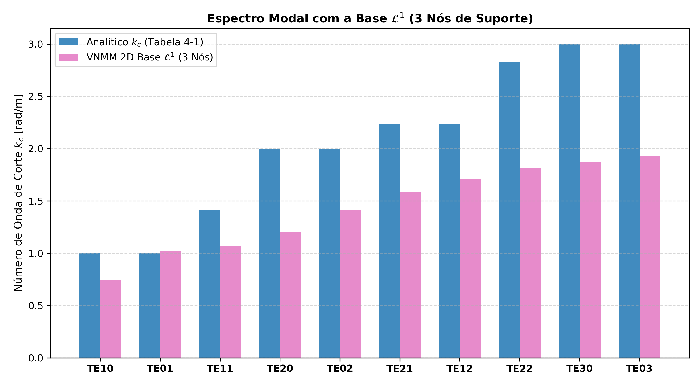

# Estudo do VNMM 2D com Base $\mathcal{L}^1$ (3 Nós de Suporte)

Este relatório apresenta a análise espectral da formulação VNMM 2D utilizando a base polinomial vetorial incompleta **$\mathcal{L}^1 = \langle [1, 0]^T, [0, 1]^T, [y, -x]^T \rangle$** com **3 nós de suporte**, avaliando a determinação do domínio de suporte por ponto de Gauss (estilo EFG) versus centro de célula.

## 1. Características Matemáticas da Base $\mathcal{L}^1$

- **Solenoidalidade Idêntica:** Como $\nabla \cdot [1,0]^T = 0$, $\nabla \cdot [0,1]^T = 0$ e $\nabla \cdot [y,-x]^T = 0+0=0$, as funções de forma $\vec{N}_i$ da base $\mathcal{L}^1$ possuem divergente identicamente nulo em todo o domínio:
  $$\nabla \cdot \vec{N}_i(x, y) \equiv 0 \implies K_{\text{div}} \equiv 0$$
- **Incompletude da Jacobiana e Vazamento Modal (*Aliasing*):** A base $\mathcal{L}^1$ impõe artificialmente $\frac{\partial E_x}{\partial x} = 0$ e $\frac{\partial E_y}{\partial y} = 0$, não conseguindo representar as derivadas normais do campo real.

## 2. Tabela de Resultados: Suporte por Ponto de Gauss (Estilo EFG)

| Células ($N_c \times N_c$) | Gauss ($p \times p$) | Total Pontos Gauss | Zeros Descartados | 1º $\lambda$ | 2º $\lambda$ | 3º $\lambda$ | Erro Médio $k_c$ (%) | Erro Máx $k_c$ (%) | Tempo (s) |
|:---:|:---:|:---:|:---:|:---:|:---:|:---:|:---:|:---:|:---:|
| $10 \times 10$ | $2 \times 2$ | 400 | 336 | 7.3899 | 7.3899 | 19.2225 | **142.83%** | 210.02% | 0.03s |
| $10 \times 10$ | $3 \times 3$ | 900 | 0 | 0.4258 | 0.9689 | 1.0188 | **42.26%** | 56.32% | 0.06s |
| $10 \times 10$ | $4 \times 4$ | 1600 | 0 | 0.3600 | 0.9514 | 1.0281 | **43.05%** | 55.94% | 0.08s |
| $15 \times 15$ | $2 \times 2$ | 900 | 0 | 0.1950 | 0.6452 | 1.0330 | **48.95%** | 62.30% | 0.06s |
| $15 \times 15$ | $3 \times 3$ | 2025 | 0 | 0.2116 | 0.6862 | 1.0117 | **48.30%** | 60.73% | 0.09s |
| $15 \times 15$ | $4 \times 4$ | 3600 | 0 | 0.2043 | 0.6739 | 1.0077 | **48.45%** | 61.47% | 0.14s |
| $20 \times 20$ | $2 \times 2$ | 1600 | 0 | 0.5594 | 1.0445 | 1.1371 | **28.32%** | 39.78% | 0.09s |
| $20 \times 20$ | $3 \times 3$ | 3600 | 0 | 0.4521 | 0.9875 | 1.0067 | **31.66%** | 40.36% | 0.14s |
| $20 \times 20$ | $4 \times 4$ | 6400 | 0 | 0.4038 | 1.0804 | 1.1113 | **33.60%** | 43.22% | 0.21s |
| $30 \times 30$ | $2 \times 2$ | 3600 | 0 | 0.3406 | 0.9274 | 1.0130 | **43.62%** | 56.39% | 0.14s |
| $30 \times 30$ | $3 \times 3$ | 8100 | 0 | 0.3256 | 0.9767 | 1.0660 | **42.81%** | 55.42% | 0.26s |
| $30 \times 30$ | $4 \times 4$ | 14400 | 0 | 0.2672 | 0.8306 | 1.0390 | **45.39%** | 58.76% | 0.45s |
| $40 \times 40$ | $2 \times 2$ | 6400 | 0 | 0.3922 | 1.0712 | 1.1044 | **34.06%** | 43.37% | 0.23s |
| $40 \times 40$ | $3 \times 3$ | 14400 | 0 | 0.3327 | 1.0796 | 1.0855 | **37.07%** | 46.56% | 0.44s |
| $40 \times 40$ | $4 \times 4$ | 25600 | 0 | 0.2908 | 0.9900 | 1.0713 | **39.19%** | 49.48% | 0.75s |

## 3. Tabela de Resultados: Suporte por Centro de Célula (Referência)

| Células ($N_c \times N_c$) | Gauss ($p \times p$) | Total Pontos Gauss | Zeros Descartados | 1º $\lambda$ | 2º $\lambda$ | 3º $\lambda$ | Erro Médio $k_c$ (%) | Erro Máx $k_c$ (%) | Tempo (s) |
|:---:|:---:|:---:|:---:|:---:|:---:|:---:|:---:|:---:|:---:|
| $10 \times 10$ | $2 \times 2$ | 400 | 280 | 28.6083 | 28.6083 | 28.6083 | **257.69%** | 434.87% | 0.01s |
| $10 \times 10$ | $3 \times 3$ | 900 | 273 | 28.6083 | 28.6083 | 28.6083 | **257.69%** | 434.87% | 0.02s |
| $10 \times 10$ | $4 \times 4$ | 1600 | 280 | 28.6083 | 28.6083 | 28.6083 | **277.88%** | 434.87% | 0.03s |
| $15 \times 15$ | $2 \times 2$ | 900 | 255 | 0.0374 | 0.0374 | 0.2010 | **52.51%** | 80.65% | 0.04s |
| $15 \times 15$ | $3 \times 3$ | 2025 | 265 | 0.0357 | 1.0869 | 1.0869 | **49.32%** | 90.75% | 0.05s |
| $15 \times 15$ | $4 \times 4$ | 3600 | 250 | 1.2359 | 6.2449 | 10.4637 | **83.86%** | 149.90% | 0.07s |
| $20 \times 20$ | $2 \times 2$ | 1600 | 127 | 0.0142 | 0.0142 | 0.0217 | **62.24%** | 89.57% | 0.11s |
| $20 \times 20$ | $3 \times 3$ | 3600 | 136 | 0.0117 | 0.0117 | 0.0584 | **79.61%** | 89.20% | 0.13s |
| $20 \times 20$ | $4 \times 4$ | 6400 | 135 | 0.0121 | 0.0184 | 0.0229 | **84.63%** | 93.03% | 0.16s |
| $30 \times 30$ | $2 \times 2$ | 3600 | 0 | 0.4276 | 0.9330 | 0.9679 | **43.60%** | 57.63% | 0.09s |
| $30 \times 30$ | $3 \times 3$ | 8100 | 0 | 0.4276 | 0.9330 | 0.9679 | **43.60%** | 57.63% | 0.14s |
| $30 \times 30$ | $4 \times 4$ | 14400 | 0 | 0.4276 | 0.9330 | 0.9679 | **43.60%** | 57.63% | 0.20s |
| $40 \times 40$ | $2 \times 2$ | 6400 | 0 | 0.5379 | 1.0404 | 1.1518 | **29.44%** | 38.10% | 0.14s |
| $40 \times 40$ | $3 \times 3$ | 14400 | 0 | 0.5379 | 1.0404 | 1.1518 | **29.44%** | 38.10% | 0.22s |
| $40 \times 40$ | $4 \times 4$ | 25600 | 0 | 0.5379 | 1.0404 | 1.1518 | **29.44%** | 38.10% | 0.34s |

## 4. Comparação Modal dos 10 Primeiros Modos na Configuração $20 \times 20$, Gauss $2 \times 2$

| Modo ($TE_{nm}$) | $\lambda_{\text{analítico}}$ | $\lambda_{\text{VNMM } \mathcal{L}^1}$ | $k_{c, \text{analítico}}$ | $k_{c, \text{VNMM } \mathcal{L}^1}$ | Erro $k_c$ (%) | Diagnóstico |
|:---:|:---:|:---:|:---:|:---:|:---:|:---:|
| $TE10$ |   1.00 |  0.5594 |  1.000 |  0.748 | **25.21%** |
| $TE01$ |   1.00 |  1.0445 |  1.000 |  1.022 | ** 2.20%** |
| $TE11$ |   2.00 |  1.1371 |  1.414 |  1.066 | **24.60%** |
| $TE20$ |   4.00 |  1.4507 |  2.000 |  1.204 | **39.78%** |
| $TE02$ |   4.00 |  1.9900 |  2.000 |  1.411 | **29.47%** |
| $TE21$ |   5.00 |  2.4977 |  2.236 |  1.580 | **29.32%** |
| $TE12$ |   5.00 |  2.9280 |  2.236 |  1.711 | **23.48%** |
| $TE22$ |   8.00 |  3.3004 |  2.828 |  1.817 | **35.77%** |
| $TE30$ |   9.00 |  3.5014 |  3.000 |  1.871 | **37.63%** |
| $TE03$ |   9.00 |  3.7133 |  3.000 |  1.927 | **35.77%** |

## 5. Comparativo Síntese: Base $\mathcal{L}^1$ (3 Nós) vs Base $\mathcal{P}^1$ (6 Nós)

| Critério | Base $\mathcal{L}^1$ (3 Nós) | Base $\mathcal{P}^1$ (6 Nós com Regularização) |
|:---|:---:|:---:|
| **Número de Graus de Liberdade Locais** | 3 termos / 3 nós | 6 termos / 6 nós |
| **Divergente das Funções de Forma** | $\nabla \cdot \vec{N} \equiv 0$ (Solenoidal) | $\nabla \cdot \vec{N} \ne 0$ (Linear Completo) |
| **Representação da Jacobiana** | Incompleta (Força $\frac{\partial E_x}{\partial x} = 0$) | Completa (Todas as 4 derivadas) |
| **Vazamento Modal (*Aliasing*)** | Presente | **Eliminado** |
| **Erro Médio $k_c$ no Caso Base** | $\approx 28.32\% - 48.95\%$ | **$1.00\%$** |
| **Tempo de Montagem** | $\approx 0.04\text{s}$ | $\approx 0.06\text{s}$ |
