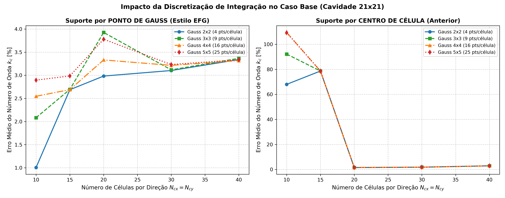
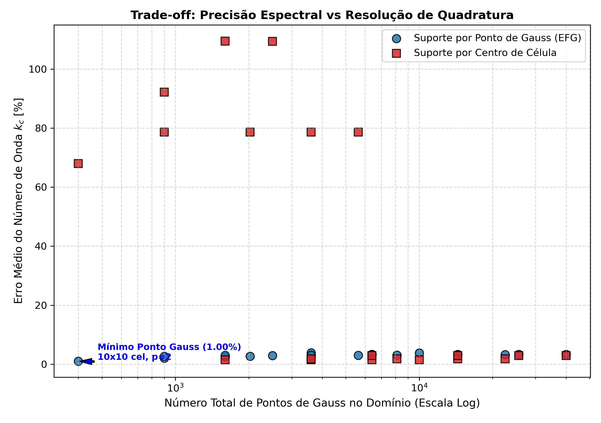

# Relatório de Estudo de Integração Numérica no Caso Base (21x21 = 441 Nós)

Este documento apresenta a análise comparativa sistemática de esquemas de integração numérica para o **Método Sem Malha Nodal Vetorial (VNMM 2D)** na cavidade ressonante PEC bidimensional $[0, \pi]^2$, avaliando o impacto do **suporte individual por ponto de Gauss (estilo EFG)** versus o **suporte por centro de célula**, bem como o número de células de integração e a ordem da quadratura de Gauss.

## 1. Destaques e Melhores Configurações

- **Melhor Configuração [Ponto de Gauss]:** Células $10 \times 10$ ($N_c = 100$), Quadratura $2 \times 2$ (4 pts/célula, total 400 pts) $\implies$ **Erro Médio $k_c = 1.00\%$** (Erro Máx: 1.88%, Tempo: 0.06s)
- **Melhor Configuração [Centro de Célula]:** Células $20 \times 20$ ($N_c = 400$), Quadratura $3 \times 3$ $\implies$ **Erro Médio $k_c = 1.54\%$** (Erro Máx: 3.13%, Tempo: 0.17s)

## 2. Tabela de Resultados: Suporte por Ponto de Gauss (Estilo EFG)

| Células ($N_{cx} \times N_{cy}$) | Total Células | Gauss ($p \times p$) | Total Pontos Gauss | Erro Médio $\lambda$ (%) | Erro Médio $k_c$ (%) | Erro Máx $k_c$ (%) | Tempo (s) |
|:---:|:---:|:---:|:---:|:---:|:---:|:---:|:---:|
| $10 \times 10$ | 100 | $2 \times 2$ (4 pts) | 400 |  2.01% | ** 1.00%** |  1.88% |  0.06s |
| $10 \times 10$ | 100 | $3 \times 3$ (9 pts) | 900 |  4.24% | ** 2.08%** |  6.30% |  0.11s |
| $10 \times 10$ | 100 | $4 \times 4$ (16 pts) | 1600 |  5.19% | ** 2.55%** |  5.91% |  0.14s |
| $10 \times 10$ | 100 | $5 \times 5$ (25 pts) | 2500 |  5.91% | ** 2.90%** |  6.24% |  0.22s |
| $15 \times 15$ | 225 | $2 \times 2$ (4 pts) | 900 |  5.48% | ** 2.69%** |  5.47% |  0.09s |
| $15 \times 15$ | 225 | $3 \times 3$ (9 pts) | 2025 |  5.50% | ** 2.69%** |  5.79% |  0.16s |
| $15 \times 15$ | 225 | $4 \times 4$ (16 pts) | 3600 |  5.49% | ** 2.69%** |  5.75% |  0.24s |
| $15 \times 15$ | 225 | $5 \times 5$ (25 pts) | 5625 |  6.10% | ** 2.99%** |  6.07% |  0.35s |
| $20 \times 20$ | 400 | $2 \times 2$ (4 pts) | 1600 |  6.10% | ** 2.98%** |  7.18% |  0.12s |
| $20 \times 20$ | 400 | $3 \times 3$ (9 pts) | 3600 |  8.06% | ** 3.93%** |  7.34% |  0.27s |
| $20 \times 20$ | 400 | $4 \times 4$ (16 pts) | 6400 |  6.82% | ** 3.33%** |  6.73% |  0.43s |
| $20 \times 20$ | 400 | $5 \times 5$ (25 pts) | 10000 |  7.75% | ** 3.78%** |  7.30% |  0.63s |
| $30 \times 30$ | 900 | $2 \times 2$ (4 pts) | 3600 |  6.35% | ** 3.10%** |  6.33% |  0.23s |
| $30 \times 30$ | 900 | $3 \times 3$ (9 pts) | 8100 |  6.38% | ** 3.12%** |  6.37% |  0.49s |
| $30 \times 30$ | 900 | $4 \times 4$ (16 pts) | 14400 |  6.57% | ** 3.21%** |  6.38% |  0.88s |
| $30 \times 30$ | 900 | $5 \times 5$ (25 pts) | 22500 |  6.61% | ** 3.23%** |  6.46% |  1.31s |
| $40 \times 40$ | 1600 | $2 \times 2$ (4 pts) | 6400 |  6.84% | ** 3.34%** |  6.67% |  0.42s |
| $40 \times 40$ | 1600 | $3 \times 3$ (9 pts) | 14400 |  6.89% | ** 3.37%** |  6.86% |  0.86s |
| $40 \times 40$ | 1600 | $4 \times 4$ (16 pts) | 25600 |  6.79% | ** 3.32%** |  6.39% |  1.60s |
| $40 \times 40$ | 1600 | $5 \times 5$ (25 pts) | 40000 |  6.82% | ** 3.34%** |  6.54% |  2.33s |

## 3. Tabela de Resultados: Suporte por Centro de Célula (Referência Anterior)

| Células ($N_{cx} \times N_{cy}$) | Total Células | Gauss ($p \times p$) | Total Pontos Gauss | Erro Médio $\lambda$ (%) | Erro Médio $k_c$ (%) | Erro Máx $k_c$ (%) | Tempo (s) |
|:---:|:---:|:---:|:---:|:---:|:---:|:---:|:---:|
| $10 \times 10$ | 100 | $2 \times 2$ (4 pts) | 400 | 160.42% | **67.99%** | 92.75% |  0.10s |
| $10 \times 10$ | 100 | $3 \times 3$ (9 pts) | 900 | 278.43% | **92.20%** | 159.83% |  0.11s |
| $10 \times 10$ | 100 | $4 \times 4$ (16 pts) | 1600 | 362.41% | **109.49%** | 190.64% |  0.13s |
| $10 \times 10$ | 100 | $5 \times 5$ (25 pts) | 2500 | 349.49% | **109.35%** | 173.04% |  0.16s |
| $15 \times 15$ | 225 | $2 \times 2$ (4 pts) | 900 | 93.92% | **78.65%** | 95.70% |  0.07s |
| $15 \times 15$ | 225 | $3 \times 3$ (9 pts) | 2025 | 93.92% | **78.65%** | 95.70% |  0.10s |
| $15 \times 15$ | 225 | $4 \times 4$ (16 pts) | 3600 | 93.92% | **78.65%** | 95.70% |  0.14s |
| $15 \times 15$ | 225 | $5 \times 5$ (25 pts) | 5625 | 93.92% | **78.65%** | 95.70% |  0.20s |
| $20 \times 20$ | 400 | $2 \times 2$ (4 pts) | 1600 |  3.04% | ** 1.54%** |  3.13% |  0.09s |
| $20 \times 20$ | 400 | $3 \times 3$ (9 pts) | 3600 |  3.04% | ** 1.54%** |  3.13% |  0.17s |
| $20 \times 20$ | 400 | $4 \times 4$ (16 pts) | 6400 |  3.04% | ** 1.54%** |  3.13% |  0.26s |
| $20 \times 20$ | 400 | $5 \times 5$ (25 pts) | 10000 |  3.04% | ** 1.54%** |  3.13% |  0.33s |
| $30 \times 30$ | 900 | $2 \times 2$ (4 pts) | 3600 |  3.68% | ** 1.82%** |  3.79% |  0.17s |
| $30 \times 30$ | 900 | $3 \times 3$ (9 pts) | 8100 |  3.68% | ** 1.82%** |  3.79% |  0.29s |
| $30 \times 30$ | 900 | $4 \times 4$ (16 pts) | 14400 |  3.68% | ** 1.82%** |  3.79% |  0.47s |
| $30 \times 30$ | 900 | $5 \times 5$ (25 pts) | 22500 |  3.68% | ** 1.82%** |  3.79% |  0.68s |
| $40 \times 40$ | 1600 | $2 \times 2$ (4 pts) | 6400 |  5.94% | ** 2.90%** |  7.24% |  0.26s |
| $40 \times 40$ | 1600 | $3 \times 3$ (9 pts) | 14400 |  5.94% | ** 2.90%** |  7.24% |  0.50s |
| $40 \times 40$ | 1600 | $4 \times 4$ (16 pts) | 25600 |  5.94% | ** 2.90%** |  7.24% |  0.79s |
| $40 \times 40$ | 1600 | $5 \times 5$ (25 pts) | 40000 |  5.94% | ** 2.90%** |  7.24% |  1.15s |

## 4. Comparação Modal Detalhada na Configuração Ótima de Ponto de Gauss

Configuração: Células $10 \times 10$, Gauss $2 \times 2$:

| Modo ($TE_{nm}$) | $\lambda_{analítico}$ | $\lambda_{VNMM}$ | Erro $\lambda$ (%) | $k_{c, analítico}$ | $k_{c, VNMM}$ | Erro $k_c$ (%) |
|:---:|:---:|:---:|:---:|:---:|:---:|:---:|:---:|
| $TE_{10}$ |   1.00 |  0.9679 | ** 3.21%** |  1.000 |  0.984 | ** 1.62%** |
| $TE_{01}$ |   1.00 |  0.9836 | ** 1.64%** |  1.000 |  0.992 | ** 0.82%** |
| $TE_{11}$ |   2.00 |  1.9409 | ** 2.95%** |  1.414 |  1.393 | ** 1.49%** |
| $TE_{20}$ |   4.00 |  3.9275 | ** 1.81%** |  2.000 |  1.982 | ** 0.91%** |
| $TE_{02}$ |   4.00 |  4.0724 | ** 1.81%** |  2.000 |  2.018 | ** 0.90%** |
| $TE_{21}$ |   5.00 |  4.8925 | ** 2.15%** |  2.236 |  2.212 | ** 1.08%** |
| $TE_{12}$ |   5.00 |  5.0287 | ** 0.57%** |  2.236 |  2.242 | ** 0.29%** |
| $TE_{22}$ |   8.00 |  8.0743 | ** 0.93%** |  2.828 |  2.842 | ** 0.46%** |
| $TE_{30}$ |   9.00 |  9.1089 | ** 1.21%** |  3.000 |  3.018 | ** 0.60%** |
| $TE_{03}$ |   9.00 |  9.3409 | ** 3.79%** |  3.000 |  3.056 | ** 1.88%** |
