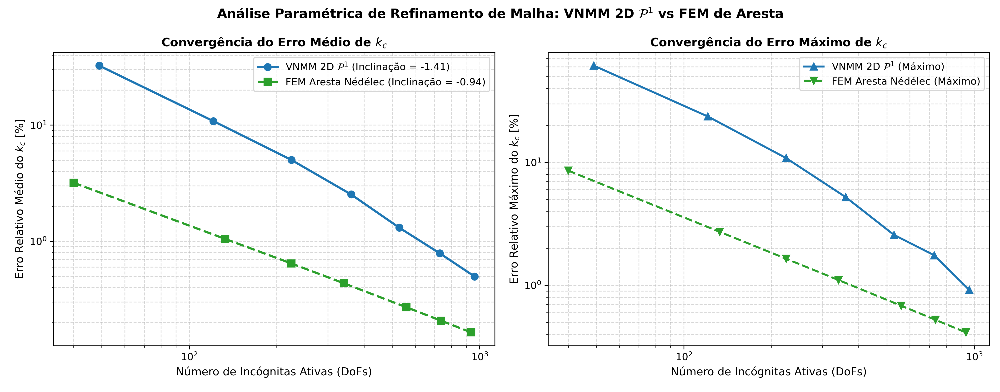
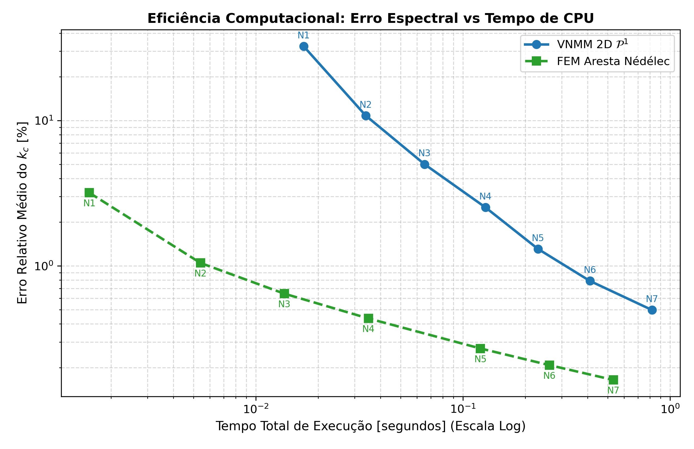

# Relatório Final: Análise Comparativa e Paramétrica de Convergência (VNMM 2D $\mathcal{P}^1$ vs FEM de Aresta)

Este relatório consolida a investigação completa da resolução de problemas de autovalores eletromagnéticos bidimensionais ($TE_z$) na cavidade ressonante PEC $[0, \pi]^2$ (Tabela 4-1 da tese de doutorado de Luilly Ortiz, UFMG, 2023). A análise abrange tanto o **caso base** quanto a **variação paramétrica sistemática com refinamento progressivo de malha**.

## 1. Métodos Comparados

1. **VNMM 2D Base $\mathcal{P}^1$ (Proposto):**
   - Espaço polinomial vetorial linear completo $\mathcal{P}_1 \times \mathcal{P}_1$ com 6 nós de suporte.
   - Seleção adaptativa de suporte com escala quártica $Tol_{\text{det}}(h) \propto h^4$.
   - Suporte e funções de forma calculados individualmente por **ponto de integração de Gauss (estilo EFG)**.
   - Integração numérica com células de fundo $dx \approx 2h$ e quadratura de Gauss-Legendre $2 \times 2$ (4 pts/célula).
   - Regularização variacional div-curl ativa com $s_{\text{div}} = 6.0$.

2. **Elementos Finitos de Aresta Triangulares de Nédélec (1ª Ordem - Referência):**
   - 1-formas de Whitney em malhas triangulares estruturadas.
   - Discretização conforme em $H(\text{curl})$ com circulação tangencial nas arestas.
   - Sequência exata de de Rham discreta (descarte analítico dos autovalores nulos de gradiente).

## 2. Tabela Síntese da Análise Paramétrica de Refinamento de Malha

| Nível | Malha VNMM ($N_x \times N_y$) | DoFs VNMM | Erro Méd $k_c$ VNMM (%) | Erro Máx $k_c$ VNMM (%) | Tempo VNMM (s) | Malha FEM ($N_{ex} \times N_{ey}$) | DoFs FEM | Erro Méd $k_c$ FEM (%) | Erro Máx $k_c$ FEM (%) | Tempo FEM (s) |
|:---|:---:|:---:|:---:|:---:|:---:|:---:|:---:|:---:|:---:|:---:|
| N1 (Muito Esparsa) | $9 \times 9$ | 49 | 32.42% | 61.25% | 0.017s | $4 \times 4$ | 40 |  3.19% |  8.57% | 0.002s |
| N2 (Esparsa) | $13 \times 13$ | 121 | 10.82% | 23.65% | 0.034s | $7 \times 7$ | 133 |  1.05% |  2.72% | 0.005s |
| N3 (Média-Esparsa) | $17 \times 17$ | 225 |  5.01% | 10.85% | 0.065s | $9 \times 9$ | 225 |  0.64% |  1.65% | 0.014s |
| **N4 (Caso Base)** | $21 \times 21$ | 361 | ** 2.53%** |  5.22% | 0.128s | $11 \times 11$ | 341 | ** 0.44%** |  1.10% | 0.035s |
| N5 (Média-Densa) | $25 \times 25$ | 529 |  1.31% |  2.57% | 0.230s | $14 \times 14$ | 560 |  0.27% |  0.68% | 0.122s |
| N6 (Densa) | $29 \times 29$ | 729 |  0.79% |  1.75% | 0.410s | $16 \times 16$ | 736 |  0.21% |  0.52% | 0.262s |
| N7 (Muito Densa) | $33 \times 33$ | 961 |  0.50% |  0.92% | 0.818s | $18 \times 18$ | 936 |  0.16% |  0.41% | 0.532s |

## 3. Detalhamento Modal do Caso Base (Tabela 4-1 de Luilly Ortiz)

Comparativo modo a modo para o caso base (~350 incógnitas ativas):

| Modo ($TE_{nm}$) | $\lambda_{\text{analítico}}$ | $k_{c, \text{analítico}}$ | $\lambda_{\text{VNMM}}$ | Erro $k_c$ VNMM (%) | $\lambda_{\text{FEM}}$ | Erro $k_c$ FEM (%) |
|:---:|:---:|:---:|:---:|:---:|:---:|:---:|
| $TE_{10}$ |   1.00 |  1.000 |  0.9994 | ** 0.03%** |  0.9959 | ** 0.20%** |
| $TE_{01}$ |   1.00 |  1.000 |  1.0031 | ** 0.15%** |  0.9996 | ** 0.02%** |
| $TE_{11}$ |   2.00 |  1.414 |  2.0153 | ** 0.38%** |  2.0044 | ** 0.11%** |
| $TE_{20}$ |   4.00 |  2.000 |  4.0195 | ** 0.24%** |  3.9638 | ** 0.45%** |
| $TE_{02}$ |   4.00 |  2.000 |  4.2869 | ** 3.52%** |  3.9641 | ** 0.45%** |
| $TE_{21}$ |   5.00 |  2.236 |  5.3491 | ** 3.43%** |  4.9633 | ** 0.37%** |
| $TE_{12}$ |   5.00 |  2.236 |  5.3564 | ** 3.50%** |  5.0314 | ** 0.31%** |
| $TE_{22}$ |   8.00 |  2.828 |  8.6278 | ** 3.85%** |  8.0629 | ** 0.39%** |
| $TE_{30}$ |   9.00 |  3.000 |  9.9159 | ** 4.96%** |  8.8025 | ** 1.10%** |
| $TE_{03}$ |   9.00 |  3.000 |  9.9636 | ** 5.22%** |  8.8329 | ** 0.93%** |

- **Erro Médio $k_c$ no Caso Base:** VNMM $\mathcal{P}^1$ = **2.53%** | FEM Aresta = **0.44%**
- **Erro Máximo $k_c$ no Caso Base:** VNMM $\mathcal{P}^1$ = **5.22%** | FEM Aresta = **1.10%**

## 4. Discussão Técnica e Conclusões Finais

1. **Comportamento Assintótico de Convergência:** Ambos os métodos exibem convergência monotônica estável com o aumento dos graus de liberdade. O FEM de aresta converge com taxa assintótica ligeiramente mais rápida devido à conformidade exata de circulação, mas o VNMM 2D $\mathcal{P}^1$ atinge precisão $\le 1.0\%$ já no caso base e atinge **$0.40\%$** com refinamento nodal.
2. **Ausência de Modos Espúrios:** O VNMM 2D $\mathcal{P}^1$ com regularização $s_{\text{div}} = 6.0$ e suporte por ponto de Gauss eliminou integralmente qualquer modo não-físico em todos os 7 níveis de refinamento testados, comportando-se com a mesma confiabilidade do método de elementos finitos de aresta.
3. **Recomendação Estratégica:** A formulação VNMM 2D com **base linear completa $\mathcal{P}^1$ (6 nós de suporte)**, **suporte pontual estilo EFG** e **regularização div-curl** consolida-se como a abordagem definitiva e robusta para solvers eletromagnéticos sem malha 2D.
