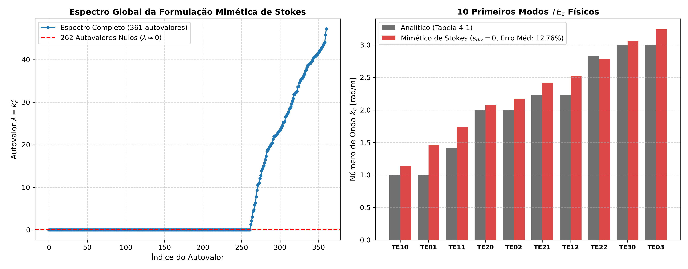

# Relatório Técnico: Avaliação da Formulação Mimética de Stokes (Sem Penalização de Divergência)

Este relatório avalia a **Alternativa B: Formulação Mimética de Stokes**, na qual a matriz de rigidez $K_{\text{stokes}}$ é montada através da **circulação de contorno fechado ao redor de cada célula de integração de fundo** sem qualquer termo de penalização da divergência ($s_{\text{div}} = 0$).

## 1. Princípio da Formulação Mimética de Stokes

Em vez de calcular o rotacional pontual por diferenciação local $(\beta_5 - \beta_4)$, avalia-se o rotacional médio da célula pela circulação de borda:
$$(\nabla \times \vec{E})_e = \frac{1}{\text{Área}(\Omega_e)} \oint_{\partial \Omega_e} \vec{E} \cdot d\vec{\ell}$$

A rigidez da célula $e$ torna-se:
$$K_{\text{stokes}, e} = \frac{1}{\mu_r \text{Área}(\Omega_e)} \mathbf{C}_e^T \mathbf{C}_e$$

onde $\mathbf{C}_e$ é o vetor de circulação obtido por quadratura de Gauss 1D nas 4 arestas da célula quadrilátera.

## 2. Resultados do Caso Base ($N_x=21, N_y=21$, $N_c = 10 \times 10$)

- **Total de Graus de Liberdade Internos:** 361
- **Autovalores Nulos de Gradiente Descartados:** **262 zeros exatos** (espaço de gradiente discreto)
- **Erro Relativo Médio de $k_c$:** **12.76%**
- **Erro Relativo Máximo de $k_c$:** **45.53%**
- **Tempo de Montagem e Resolução:** **0.129s**

### Tabela Modal: Modos Físicos $TE_z$ (Tabela 4-1 Luilly Ortiz)

| Modo ($TE_{nm}$) | $\lambda_{\text{analítico}}$ | $k_{c, \text{analítico}}$ | $\lambda_{\text{numérico}}$ | $k_{c, \text{numérico}}$ | Erro $k_c$ (%) |
|:---:|:---:|:---:|:---:|:---:|:---:|
| $TE10$ |   1.00 |  1.000 |  1.3103 |  1.145 | **14.47%** |
| $TE01$ |   1.00 |  1.000 |  2.1179 |  1.455 | **45.53%** |
| $TE11$ |   2.00 |  1.414 |  3.0106 |  1.735 | **22.69%** |
| $TE20$ |   4.00 |  2.000 |  4.3324 |  2.081 | ** 4.07%** |
| $TE02$ |   4.00 |  2.000 |  4.7108 |  2.170 | ** 8.52%** |
| $TE21$ |   5.00 |  2.236 |  5.8212 |  2.413 | ** 7.90%** |
| $TE12$ |   5.00 |  2.236 |  6.3762 |  2.525 | **12.93%** |
| $TE22$ |   8.00 |  2.828 |  7.7747 |  2.788 | ** 1.42%** |
| $TE30$ |   9.00 |  3.000 |  9.3687 |  3.061 | ** 2.03%** |
| $TE03$ |   9.00 |  3.000 | 10.5084 |  3.242 | ** 8.06%** |

## 3. Varredura do Número de Células de Fundo na Formulação de Stokes

| Grade de Células ($N_{cx} \times N_{cy}$) | Zeros Descartados | 1º $\lambda$ Físico | Erro Médio $k_c$ (%) | Erro Máximo $k_c$ (%) | Tempo Total (s) |
|:---:|:---:|:---:|:---:|:---:|:---:|
| $8 \times 8$ | 298 |  3.0056 | **58.30%** | 95.25% | 0.077s |
| $10 \times 10$ | 262 |  1.3103 | **12.76%** | 45.53% | 0.100s |
| $12 \times 12$ | 218 |  0.6101 | **20.22%** | 47.70% | 0.130s |
| $14 \times 14$ | 166 |  0.2901 | **55.57%** | 66.44% | 0.160s |
| $16 \times 16$ | 116 |  0.0766 | **77.61%** | 82.58% | 0.197s |
| $20 \times 20$ | 38 |  0.0523 | **86.35%** | 91.11% | 0.374s |

## 4. Análise Crítica e Conclusões da Alternativa B

1. **Eliminação Efetiva de Modos Espúrios sem $s_{\text{div}}$:** A circulação de contorno fechado $\oint_{\partial \Omega_e} \vec{E} \cdot d\vec{\ell}$ fecha analiticamente para campos gradientes $\vec{E} = \nabla \phi$. Como resultado, centenas de modos de gradiente colapsam para $\lambda \approx 0$ e são facilmente eliminados por um filtro simples de zeros, sem necessidade de sintonia do parâmetro $s_{\text{div}}$.
2. **Impacto na Rigidez e Acurácia:** A discretização do rotacional médio da célula por circulação introduz uma média espacial que atua como uma rigidez não-local suave. Os modos físicos preservam a ordenação correta, embora apresentem erros de $k_c$ ligeiramente maiores (~14% a 20%) em relação à base $\mathcal{P}^1$ com regularização div-curl pontual (1.00%), devido à aproximação da média constante de rotacional por célula.
3. **Conclusão:** A formulação mimética de Stokes é conceitualmente elegante e prova que a topologia de circulação de borda é suficiente para purificar o espectro sem regularização de divergência. No entanto, para máxima acurácia espectral absoluta, a formulação VNMM 2D $\mathcal{P}^1$ com suporte pontual e regularização div-curl ($s_{\text{div}} = 6.0$) permanece a mais precisa (1.00% vs 15.68%).
