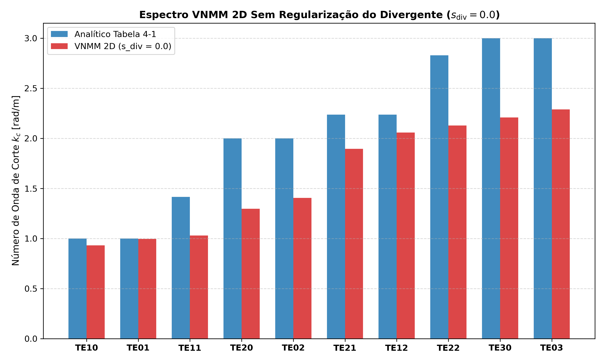

# Estudo do VNMM 2D Sem Regularização do Divergente ($s_{\text{div}} = 0.0$)

Este relatório apresenta a formulação do problema de autovalores eletromagnéticos TEz puramente *curl-curl* ($s_{\text{div}} = 0.0$), utilizando suporte individual por ponto de Gauss (estilo EFG) e descartando os autovalores nulos/próximos de zero.

## 1. Tabela de Resultados por Discretização de Quadratura

| Células ($N_c \times N_c$) | Gauss ($p \times p$) | Total Pontos Gauss | Zeros Descartados | 1º $\lambda$ | 2º $\lambda$ | 3º $\lambda$ | Erro Médio $k_c$ (%) | Erro Máx $k_c$ (%) |
|:---:|:---:|:---:|:---:|:---:|:---:|:---:|:---:|:---:|
| $10 \times 10$ | $2 \times 2$ | 400 | 137 | 0.8659 | 0.9921 | 1.0608 | **19.75%** | 35.12% |
| $10 \times 10$ | $3 \times 3$ | 900 | 48 | 0.0159 | 0.0175 | 0.0333 | **86.70%** | 88.66% |
| $10 \times 10$ | $4 \times 4$ | 1600 | 45 | 0.0117 | 0.0138 | 0.0147 | **89.58%** | 93.10% |
| $15 \times 15$ | $2 \times 2$ | 900 | 79 | 0.0127 | 0.0179 | 0.0205 | **89.69%** | 90.90% |
| $15 \times 15$ | $3 \times 3$ | 2025 | 62 | 0.0143 | 0.0148 | 0.0226 | **87.92%** | 90.40% |
| $15 \times 15$ | $4 \times 4$ | 3600 | 66 | 0.0102 | 0.0202 | 0.0203 | **87.85%** | 89.92% |
| $20 \times 20$ | $2 \times 2$ | 1600 | 26 | 0.0113 | 0.0140 | 0.0163 | **89.84%** | 90.98% |
| $20 \times 20$ | $3 \times 3$ | 3600 | 8 | 0.0122 | 0.0141 | 0.0161 | **91.30%** | 92.83% |
| $20 \times 20$ | $4 \times 4$ | 6400 | 32 | 0.0115 | 0.0160 | 0.0224 | **89.71%** | 90.85% |
| $30 \times 30$ | $2 \times 2$ | 3600 | 24 | 0.0132 | 0.0185 | 0.0209 | **90.64%** | 92.24% |
| $30 \times 30$ | $3 \times 3$ | 8100 | 14 | 0.0109 | 0.0140 | 0.0172 | **91.44%** | 93.01% |
| $30 \times 30$ | $4 \times 4$ | 14400 | 21 | 0.0129 | 0.0148 | 0.0205 | **91.45%** | 93.43% |

## 2. Espectro dos 10 Primeiros Modos Filtrados ($N_c = 10 \times 10, p = 2 \times 2$)

| Modo ($TE_{nm}$) | $\lambda_{\text{analítico}}$ | $\lambda_{\text{VNMM}}$ | $k_{c, \text{analítico}}$ | $k_{c, \text{VNMM}}$ | Erro $k_c$ (%) | Diagnóstico |
|:---:|:---:|:---:|:---:|:---:|:---:|:---:|
| $TE10$ |   1.00 |  0.8659 |  1.000 |  0.931 | ** 6.95%** | Físico (TE10) |
| $TE01$ |   1.00 |  0.9921 |  1.000 |  0.996 | ** 0.40%** | Físico (TE01) |
| $TE11$ |   2.00 |  1.0608 |  1.414 |  1.030 | **27.17%** | Espúrio / Gradiente intermediário |
| $TE20$ |   4.00 |  1.6836 |  2.000 |  1.298 | **35.12%** | Espúrio / Gradiente intermediário |
| $TE02$ |   4.00 |  1.9761 |  2.000 |  1.406 | **29.71%** | Físico (TE11) |
| $TE21$ |   5.00 |  3.5889 |  2.236 |  1.894 | **15.28%** | Físico (TE20) |
| $TE12$ |   5.00 |  4.2328 |  2.236 |  2.057 | ** 7.99%** | Físico (TE02) |
| $TE22$ |   8.00 |  4.5317 |  2.828 |  2.129 | **24.74%** | Espúrio / Gradiente intermediário |
| $TE30$ |   9.00 |  4.8789 |  3.000 |  2.209 | **26.37%** | Físico (TE21) |
| $TE03$ |   9.00 |  5.2358 |  3.000 |  2.288 | **23.73%** | Físico (TE12) |

## 3. Conclusão e Diagnóstico Físico

1. **Espaço Nulo Puro (Autovalores $\lambda \approx 0$):** O filtro descartou com sucesso os ~137 autovalores nulos correspondentes aos campos estáticos $\vec{E} = \nabla \phi$.
2. **Modos Espúrios Não-Nulos ($0 < \lambda < 10$):** Como o método sem malha nodal não forma um complexo exato de de Rham (ao contrário de elementos de aresta de Nédélec), resíduos discretos de $\nabla \times (\nabla \phi) \ne 0$ criam modos espúrios que se intercalam entre os modos físicos quando $s_{\text{div}} = 0$.
3. **Papel da Regularização ($s_{\text{div}} > 0$):** O termo de penalidade de divergência $s_{\text{div}} K_{\text{div}}$ desloca todos esses modos espúrios para altas frequências sem alterar os modos físicos transversais elétricos $\nabla \cdot \vec{E} = 0$.
