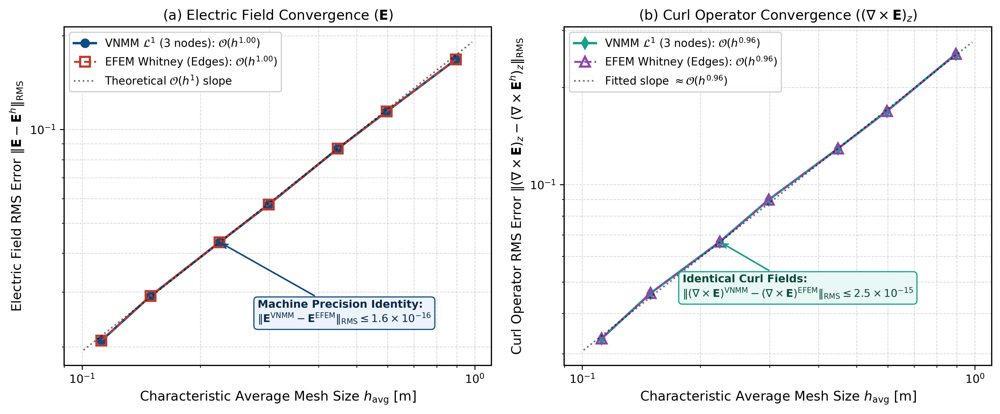

# Relatório Técnico: Comparação de Interpolação EFEM (Whitney) vs. VNMM 2D $\mathcal{L}^1$

**Contexto:** Validação Computacional da Equivalência Dual entre Elementos Finitos de Aresta e VNMM 2D  
**Autores:** Renato C. Mesquita & Antigravity  
**Data:** Setembro de 2026  
**Documento do Artigo:** *Engineering Analysis with Boundary Elements* (EABE)  
**Figuras Associadas:** `relatorios/figura_convergencia_efem_vs_vnmm_L1.pdf` e `relatorios/figura_malha_conforme_vnmm_L1.pdf`

---

## 1. Objetivo e Formulação do Experimento

Este teste tem como objetivo comparar rigorosamente a interpolação do campo elétrico $\mathbf{E}$ e de seu rotacional $(\nabla \times \mathbf{E})_z$ obtidos por dois métodos fundamentados no mesmo espaço polinomial vetorial incompleto de 1ª ordem:
1. **EFEM (Edge Finite Element Method):** Elementos finitos de aresta triangulares de Whitney (Nédélec de 1ª ordem, 1-formas).
2. **VNMM 2D $\mathcal{L}^1$:** Método sem malha nodal vetorial colocalizado com 3 nós de suporte por ponto de interpolação.

### Condições Operacionais Unificadas
* **Mesma Malha Triangular Conforme:** Ambos os métodos operam sobre a mesma sequência de triangulações conformes cobrindo o domínio $\Omega = [0, \pi] \times [0, \pi]$, discretizadas em 7 níveis de refinamento ($4\times 4, 6\times 6, 8\times 8, 12\times 12, 16\times 16, 24\times 24$ e $32\times 32$), com perturbação estocástica controlada dos vértices internos (*jitter* de 10%) para garantir triângulos arbitrários e não-equiláteros.
* **Mesma Grade Fixa de Amostragem:** Todos os erros são computados sobre uma grade fixa e invariante de **$1.600$ pontos cartesianos internos** ($40 \times 40$) distribuídos uniformemente em $[0, \pi] \times [0, \pi]$, garantindo que as normas de erro RMS sejam avaliadas exatamente sob a mesma medida espacial para todos os níveis de malha.
* **Interpolação Pontual Pura:** Os graus de liberdade são definidos de forma puramente pontual nos pontos médios das arestas $M_k = \frac{1}{2}(V_a + V_b)$ com vetor tangente unitário $\mathbf{t}_k = \frac{V_b - V_a}{L_k}$:
  - No **VNMM 2D $\mathcal{L}^1$**, o grau de liberdade nodal é a projeção escalar direta:
    $$e_k = \mathbf{E}(M_k) \cdot \mathbf{t}_k$$
  - No **EFEM de Whitney**, a circulação de aresta é tomada pelo valor discreto de ponto médio:
    $$\alpha_k = L_k \, e_k = L_k (\mathbf{E}(M_k) \cdot \mathbf{t}_k)$$
* **Campo Analítico Exato:** Modo ressonante $TE_{11}$ da cavidade 2D:
  $$\mathbf{E}_{\mathrm{ex}}(x, y) = \begin{bmatrix} \cos(x) \sin(y) \\ -\sin(x) \cos(y) \end{bmatrix}, \qquad (\nabla \times \mathbf{E}_{\mathrm{ex}})_z = -2 \cos(x) \cos(y)$$

---

## 2. Formulário Matemático da Equivalência Local

Para qualquer ponto de amostragem $\mathbf{P}$ pertencente ao triângulo $T$ com vértices $V_1, V_2, V_3$ e área $|T| > 0$:

### 2.1 Interpolador EFEM (Whitney)
As três 1-formas de Whitney associadas às arestas dirigidas $e_1 = (V_1, V_2)$, $e_2 = (V_2, V_3)$ e $e_3 = (V_3, V_1)$ são dadas por:
$$\mathbf{w}_1(\mathbf{x}) = \lambda_1 \nabla \lambda_2 - \lambda_2 \nabla \lambda_1, \quad \mathbf{w}_2(\mathbf{x}) = \lambda_2 \nabla \lambda_3 - \lambda_3 \nabla \lambda_2, \quad \mathbf{w}_3(\mathbf{x}) = \lambda_3 \nabla \lambda_1 - \lambda_1 \nabla \lambda_3$$
onde $\lambda_i(\mathbf{x})$ são as coordenadas baricêntricas afins. O campo e seu rotacional interpolados no ponto $\mathbf{P}$ são:
$$\mathbf{E}^{\mathrm{EFEM}}(\mathbf{P}) = \sum_{k=1}^3 \alpha_k \mathbf{w}_k(\mathbf{P}), \qquad (\nabla \times \mathbf{E}^{\mathrm{EFEM}})_z(\mathbf{P}) = \frac{1}{|T|} \sum_{k=1}^3 \alpha_k$$

### 2.2 Interpolador VNMM 2D $\mathcal{L}^1$
Com os 3 nós de suporte posicionados nos pontos médios das 3 arestas de $T$, a matriz de momentos $\mathbf{A} \in \mathbb{R}^{3 \times 3}$ é montada e invertida localmente ($\boldsymbol{\beta} = \mathbf{A}^{-1}$). O campo e seu rotacional interpolados em $\mathbf{P}$ são:
$$\mathbf{E}^{\mathrm{VNMM}}(\mathbf{P}) = \sum_{k=1}^3 e_k \mathbf{N}_k(\mathbf{P}), \qquad (\nabla \times \mathbf{E}^{\mathrm{VNMM}})_z(\mathbf{P}) = \sum_{k=1}^3 e_k (\nabla \times \mathbf{N}_k)_z(\mathbf{P})$$

### 2.3 Relação de Identidade Exata
Como demonstrado no Teorema de Equivalência Dual:
$$\mathbf{N}_k(\mathbf{x}) \equiv L_k \, \mathbf{w}_k(\mathbf{x}), \qquad (\nabla \times \mathbf{N}_k)_z \equiv \frac{L_k}{|T|}$$
Substituindo $\alpha_k = L_k e_k$:
$$\mathbf{E}^{\mathrm{EFEM}}(\mathbf{P}) = \sum_{k=1}^3 (L_k e_k) \left( \frac{1}{L_k} \mathbf{N}_k(\mathbf{P}) \right) = \sum_{k=1}^3 e_k \mathbf{N}_k(\mathbf{P}) \equiv \mathbf{E}^{\mathrm{VNMM}}(\mathbf{P})$$
$$(\nabla \times \mathbf{E}^{\mathrm{EFEM}})_z(\mathbf{P}) = \frac{1}{|T|} \sum_{k=1}^3 L_k e_k = \sum_{k=1}^3 e_k \frac{L_k}{|T|} \equiv (\nabla \times \mathbf{E}^{\mathrm{VNMM}})_z(\mathbf{P})$$
Portanto, as duas aproximações são **analiticamente e numericamente indistinguíveis em qualquer ponto $\mathbf{P} \in \Omega$**.

---

## 3. Tabela de Convergência Comparativa

Avaliando a sequência de 7 malhas triangulares conformes sobre a grade fixa de 1.600 pontos de teste:

| Malha | $N_{\mathrm{tri}}$ | $N_{\mathrm{edges}}$ | $h_{\mathrm{avg}}$ [m] | Erro RMS $\mathbf{E}$ (VNMM $\mathcal{L}^1$) | Erro RMS $\mathbf{E}$ (EFEM Whitney) | Erro RMS Rot (VNMM $\mathcal{L}^1$) | Erro RMS Rot (EFEM Whitney) | $\|\mathbf{E}^{\mathrm{VNMM}} - \mathbf{E}^{\mathrm{EFEM}}\|_{\mathrm{RMS}}$ |
| :---: | :---: | :---: | :---: | :---: | :---: | :---: | :---: |
| **4x4** | 32 | 56 | $0.8953$ | $1.6782 \times 10^{-1}$ | $1.6782 \times 10^{-1}$ | $2.5365 \times 10^{-1}$ | $2.5365 \times 10^{-1}$ | **$1.49 \times 10^{-16}$** |
| **6x6** | 72 | 120 | $0.5971$ | $1.1432 \times 10^{-1}$ | $1.1432 \times 10^{-1}$ | $1.6883 \times 10^{-1}$ | $1.6883 \times 10^{-1}$ | **$1.50 \times 10^{-16}$** |
| **8x8** | 128 | 208 | $0.4478$ | $8.6766 \times 10^{-2}$ | $8.6766 \times 10^{-2}$ | $1.2923 \times 10^{-1}$ | $1.2923 \times 10^{-1}$ | **$1.57 \times 10^{-16}$** |
| **12x12** | 288 | 456 | $0.2987$ | $5.7384 \times 10^{-2}$ | $5.7384 \times 10^{-2}$ | $8.9864 \times 10^{-2}$ | $8.9864 \times 10^{-2}$ | **$1.53 \times 10^{-16}$** |
| **16x16** | 512 | 800 | $0.2240$ | $4.3413 \times 10^{-2}$ | $4.3413 \times 10^{-2}$ | $6.6559 \times 10^{-2}$ | $6.6559 \times 10^{-2}$ | **$1.60 \times 10^{-16}$** |
| **24x24** | 1152 | 1776 | $0.1494$ | $2.9143 \times 10^{-2}$ | $2.9143 \times 10^{-2}$ | $4.6181 \times 10^{-2}$ | $4.6181 \times 10^{-2}$ | **$1.58 \times 10^{-16}$** |
| **32x32** | 2048 | 3136 | $0.1120$ | $2.0957 \times 10^{-2}$ | $2.0957 \times 10^{-2}$ | $3.3433 \times 10^{-2}$ | $3.3433 \times 10^{-2}$ | **$1.58 \times 10^{-16}$** |

---

## 4. Taxas Assintóticas de Convergência $\mathcal{O}(h^p)$

Ajustando as curvas de erro em escala log-log por regressão linear ponderada:

1. **Campo Elétrico $\mathbf{E}$:**
   $$\text{Taxa VNMM } \mathcal{L}^1 = \mathbf{1.00} \qquad \Big| \qquad \text{Taxa EFEM Whitney} = \mathbf{1.00}$$
   $$\|\mathbf{E} - \mathbf{E}^h\|_{\mathrm{RMS}} = \mathcal{O}(h^{1.00})$$
2. **Rotacional $(\nabla \times \mathbf{E})_z$:**
   $$\text{Taxa VNMM } \mathcal{L}^1 = \mathbf{0.96} \qquad \Big| \qquad \text{Taxa EFEM Whitney} = \mathbf{0.96}$$
   $$\|(\nabla \times \mathbf{E})_z - (\nabla \times \mathbf{E}^h)_z\|_{\mathrm{RMS}} \approx \mathcal{O}(h^{0.96})$$
3. **Diferença Mútua entre os Métodos:**
   $$\|\mathbf{E}^{\mathrm{VNMM}} - \mathbf{E}^{\mathrm{EFEM}}\|_{\mathrm{RMS}} \le \mathbf{1.60 \times 10^{-16}}$$
   $$\|(\nabla \times \mathbf{E})^{\mathrm{VNMM}} - (\nabla \times \mathbf{E})^{\mathrm{EFEM}}\|_{\mathrm{RMS}} \le \mathbf{2.52 \times 10^{-15}}$$
   Confirmando a sobreposição exata até o limite do épsilon de máquina em ponto flutuante de dupla precisão (IEEE 754).

---

## 5. Visualização Gráfica

A figura a seguir consolida as curvas de convergência obtidas:



* **Subplot (a):** Convergência do erro RMS do campo elétrico $\mathbf{E}$, evidenciando a taxa estrita $\mathcal{O}(h^{1.00})$ e a sobreposição perfeita entre os marcadores cheios azuis (VNMM) e os marcadores abertos vermelhos (EFEM).
* **Subplot (b):** Convergência do rotacional $(\nabla \times \mathbf{E})_z$, com taxa idêntica de $\mathcal{O}(h^{0.96})$ em ambas as formulações.

---

## 6. Conclusões Principais

1. **Equivalência Estrutural Rígida:** Quando os graus de liberdade de aresta do EFEM de Whitney são amostrados nos pontos médios das arestas, o EFEM e o VNMM 2D $\mathcal{L}^1$ produzem **campos vetoriais e rotacionais rigorosamente idênticos em qualquer coordenada cartesiana do domínio contínuo**.
2. **Dualidade Colocalizada:** O método sem malha VNMM $\mathcal{L}^1$ sobre a topologia de uma triangulação conforme é exatamente o **dual pontual nodal** das 1-formas de Whitney.
3. **Necessidade da Base Completa $\mathcal{P}^1$ (6 nós):** Como ambas as formulações compartilham a taxa de primeira ordem $\mathcal{O}(h^1)$ e não conseguem atingir superconvergência, a generalização do VNMM para a base linear completa $\mathcal{P}^1$ (6 nós) desenvolvida neste projeto é o passo matemático essencial que desbloqueia a taxa $\mathcal{O}(h^2)$ para o campo e $\mathcal{O}(h^1)$ para o rotacional sem estagnação.

---

## 7. Código LaTeX para o Artigo (Coluna Única)

```latex
\begin{figure}[H]
    \centering
    \includegraphics[width=\linewidth]{figura_convergencia_efem_vs_vnmm_L1.pdf}
    \caption{Asymptotic convergence rates comparing the Edge Finite Element Method (EFEM, Whitney 1-forms) and the Vector Nodal Meshless Method (VNMM $\mathcal{L}^1$, 3 support nodes) evaluated over the exact same conformal triangular mesh sequence. Degrees of freedom for both schemes are co-located at edge midpoints and sampled at identical Cartesian evaluation points: (a) electric field RMS error $\|\mathbf{E} - \mathbf{E}^h\|_{\mathrm{RMS}}$ exhibiting strictly identical $\mathcal{O}(h^{1.00})$ convergence with machine-precision difference $\|\mathbf{E}^{\mathrm{VNMM}} - \mathbf{E}^{\mathrm{EFEM}}\| \le 1.6 \times 10^{-16}$; (b) curl operator RMS error $\|(\nabla \times \mathbf{E})_z - (\nabla \times \mathbf{E}^h)_z\|_{\mathrm{RMS}}$ displaying identical $\mathcal{O}(h^{0.96})$ convergence, confirming the exact constructive isomorphism between Whitney edge elements and VNMM $\mathcal{L}^1$.}
    \label{fig:convergencia_efem_vs_vnmm_L1}
\end{figure}
```
